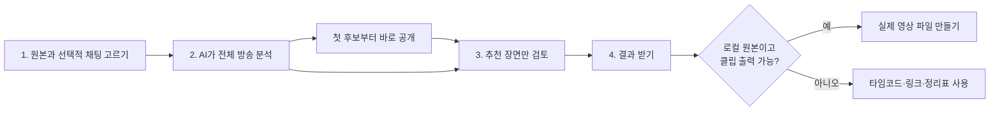
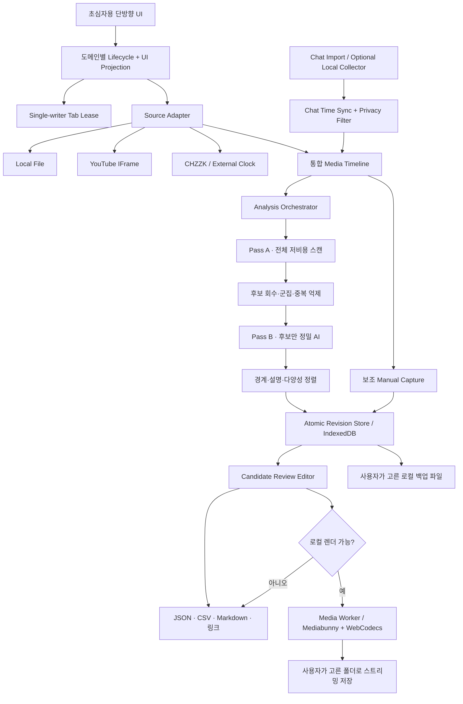

# Retto Highlight 제품·UX·기술 계획서

- 문서 상태: 개인 편집 어시스턴트·상태/운영 모델을 확정한 초안 `0.3.0`
- 기준일: 2026-07-19 (Asia/Seoul)
- 배포 원칙: GitHub Pages에서 로컬 빠른 분석은 서버 없이 완주하고, 선택형 Gemini 정밀 분석은 사용자 소유 키와 명시적 동의가 있을 때 후보 오디오만 직접 전송함
- 제품 정체성: 공유 서비스가 아닌 1인용 로컬 우선 AI 편집 어시스턴트
- 대상 사용자: 컴퓨터와 영상 편집에 익숙하지 않은 스트리머 또는 개인 편집자
- 상세 계약: 상태·전이는 `STATE_LIFECYCLE.md`, 배포·백업·장애 대응은 `OPERATIONS.md`

## 0. 먼저 합의해야 할 결론

이 제품의 중심은 “링크 영상을 몰래 내려받아 자르는 웹 다운로더”도, “사용자가 몇 시간 내내 보며 버튼을 누르는 타임코드 메모장”도 아니다.

> 분석 가능한 최대 12시간의 방송 원본과 선택적 자막·채팅 기록을 AI가 먼저 끝까지 훑고, 사람이 짧은 추천 후보만 재생해 30~60초 클립과 긴 하이라이트를 확정하는 로컬 우선 편집 보조 웹앱이다.

원본 1개의 지원 상한은 YouTube 업로드 기준에 맞춘 12시간이다. 정확히 12시간은 정상 입력이며 그보다 긴 파일은 분석을 시작하지 않고 12시간 이하로 나누도록 안내한다. 12시간을 넘는 단일 원본의 성능·저장·복구·출력은 제품 범위에 포함하지 않는다.

핵심 가치는 `전체 원본 시청 시간`을 `AI 분석 대기 + 후보 검토 시간`으로 바꾸는 데 있다. 수동 장면 표시는 AI가 놓친 장면을 추가하거나 생방송 중 즉시 메모할 때 쓰는 보조 기능이다. 제품이 입력별로 보장할 결과와 조건부 결과를 처음부터 분리한다.

이 앱은 여러 사용자를 연결하는 서비스가 아니다. 계정·팀·초대·공동 편집·원격 프로젝트 DB·기기간 자동 동기화 없이, 한 사용자의 브라우저와 로컬 파일 안에서 작업한다. 같은 공개 Pages 주소를 여러 사람이 각자 열 수는 있지만 서로의 프로젝트·원본·후보는 보거나 공유하지 않는다. 공용 개발 지침의 일반적인 소규모 공유 서비스 기본값보다 이 프로젝트의 구체적인 개인용 범위가 우선한다.

### 항상 보장할 결과

- 후보 장면의 시작·끝 시각
- 제목, 메모, 태그, 우선순위, 검토 상태
- AI 분석을 실행한 경우 사용한 신호, 추천 이유, 분석하지 못한 구간을 포함한 분석 기록
- 원본으로 돌아가는 링크
- 사람이 읽는 Markdown, Excel용 CSV, 복원용 JSON
- 새로고침·재접속 뒤 작업 복원
- 사람의 경계·제목·승인 판단을 늦은 AI 결과가 덮어쓰지 않음
- 프로젝트당 한 개의 쓰기 탭과 다른 탭의 안전한 읽기 전용 안내

### 조건부로 제공할 결과

- 실제 MP4/WebM 클립 파일 생성
  - 사용자가 편집 권리를 가진 로컬 원본 파일에서만 제공한다.
  - 브라우저가 입력 코덱을 읽고 출력 코덱을 만들 수 있을 때만 제공한다.
  - 작업 시작 전에 “이 파일은 실제 클립 저장 가능” 여부를 미리 검사한다.
- 전체 영상 기반 AI 추천
  - 로컬 원본 또는 브라우저가 실제 미디어 샘플을 읽을 수 있는 소스에서 제공한다.
  - 사용자가 직접 넣은 자막·채팅 로그를 함께 쓰면 추천 근거와 회수율을 높인다.
  - YouTube·CHZZK 일반 시청 링크만 넣은 경우에는 프레임·오디오를 읽을 수 없으므로 전체 영상 AI 분석을 제공한다고 약속하지 않는다.
- 자막·채팅만 있는 제한 분석
  - 미디어 없이도 반응 급증과 대화 내용을 바탕으로 후보 시각을 제안할 수 있다.
  - 결과에 `채팅·텍스트만 분석`, `영상·음성 미분석` 배지를 붙이고 신뢰도를 낮춘다.

### 절대 약속하지 않을 것

- 모든 YouTube·CHZZK 링크의 영상 파일 다운로드
- 문서화되지 않은 스트림 URL 추출, 스크래핑, CORS 우회 프록시
- 정적 사이트 코드·저장소·빌드 결과에 공용 비밀 API 키나 Client Secret 삽입
- AI가 사람 검토 없이 최종 클립을 자동 확정·게시
- 계정·팀 공유·공동 편집·원격 프로젝트 동기화
- 원본 전체·영상 프레임·채팅을 공용 백엔드나 클라우드 AI로 업로드하거나, 동의 없이 후보 오디오를 전송
- 서버가 대신 수집·분석·렌더·게시하는 서비스
- 모든 브라우저와 모든 코덱에서 수십 GB 영상을 빠르게 자름
- 로그인·연령·지역·퍼가기 제한을 우회함

이 경계는 기술적 한계만이 아니라 플랫폼 정책, 저작권, 사용자의 신뢰를 함께 지키기 위한 제품 경계다.

## 1. 입력별 현실적인 지원 범위

| 입력 | 앱 안 재생 | 현재 시각 자동 취득 | 구간 미리보기 | 자동 분석 | 실제 영상 파일 출력 |
|---|---:|---:|---:|---:|---:|
| 내 컴퓨터의 영상 파일(최대 12시간) | 브라우저/코덱 지원 시 가능 | 가능 | 가능 | 영상·음성 로컬 AI 가능 | 조건 충족 시 가능 |
| YouTube 일반 링크만 | 공식 iframe 허용 시 가능 | 가능 | 시작·끝 범위 재생 가능 | 미디어 분석 불가 | 불가 |
| YouTube 링크 + 사용자가 가져온 자막·채팅 | 공식 iframe 허용 시 가능 | 가능 | 시작·끝 범위 재생 가능 | 텍스트·채팅 제한 분석 | 불가 |
| CHZZK LIVE/VOD 일반 링크만 | 공식 제어형 임베드가 없어 외부 열기 중심 | 공식적으로 불가 | 시각표 중심 | 미디어 분석 불가 | 불가 |
| CHZZK 링크 + 동기화된 채팅 로그 | 외부 열기 중심 | 로그 기준 시각 | 시각표 중심 | 채팅 제한 분석 | 불가 |
| 이미 만든 CHZZK 클립 링크 | 공식 퍼가기 iframe 가능 | 제어 API 없음 | 클립 자체 재생 | 불가 | 새 파일 출력 불가 |
| CORS·Range가 허용된 직접 미디어 URL | 조건부 가능 | 조건부 가능 | 조건부 가능 | 조건부 가능 | 권리·코덱 충족 시 가능 |

사용자에게는 “지원/미지원” 한 단어 대신 입력 직후 정확한 결과를 알려 준다.

- 로컬 파일: “영상은 인터넷으로 보내지 않고 이 컴퓨터에서 AI가 먼저 훑어요. 추천 장면이 생기는 즉시 검토를 시작할 수 있어요.”
- YouTube 링크만: “이 링크로는 플레이어의 영상·음성을 AI가 읽을 수 없어요. 내 영상 파일이나 자막·채팅 기록을 추가하면 분석할 수 있어요.”
- CHZZK 링크만: “치지직 링크만으로는 영상을 AI가 읽을 수 없어요. 원본 파일이나 같은 방송의 채팅 기록을 추가해 주세요.”

### 1.1 YouTube의 2026년 변경

2026년 4월부터 시청자용 새 YouTube Clips 생성은 `Share at Timestamp`로 대체되었다. 기존 Clips는 남지만 새 공유는 시작 시각만 담고 종료 시각·설명을 담지 못한다. 따라서 앱 내부에는 시작과 끝을 모두 보존하고, YouTube로 내보낼 때는 다음처럼 표현한다.

- 시작 링크: `원본 영상의 01:23:25에서 열기`
- 앱 내부 재생 범위: `01:23:25–01:24:10`
- 외부 공유 안내: “YouTube 링크는 시작 지점만 기억합니다. 종료는 01:24:10입니다.”

채널 소유자가 자기 영상을 편집하는 경우에는 별도 후속 버튼으로 YouTube Studio의 Video Clips 도구 사용법을 안내할 수 있다. 이것은 공개 Data API 클립 생성 기능이 아니다.

### 1.2 CHZZK의 공식 범위

공식 Open API는 라이브 목록·채널·방송 설정·채팅 등의 기능을 제공하지만 일반 VOD 바이트, VOD 재생 제어, 클립 생성·다운로드 API를 제공하지 않는다. Session API는 라이브 중 `CHAT`, `DONATION`, `SUBSCRIPTION` 이벤트를 구독하고 메시지 시각을 받을 수 있지만, 문서화된 과거 VOD 채팅 전체 조회 API는 아니다. 세션 생성·사용자 인증에는 Client 인증 또는 OAuth 흐름이 얽히며 Client Secret을 정적 번들에 넣을 수 없고 브라우저 CORS 지원도 핵심 경로로 보장되지 않으므로 GitHub Pages가 공식 API에 직접 접속하는 구조를 기본으로 삼지 않는다.

CHZZK의 공식 클립은 스트리머가 허용한 LIVE의 가위 버튼으로 만들고, CHZZK가 인코딩한다. 앱은 다음 연결 역할을 한다.

1. 후보 시각과 이유를 기록한다.
2. `치지직에서 클립 만들기`로 원본 페이지를 연다.
3. 사용자가 만든 최종 CHZZK 클립 URL을 후보 카드에 붙인다.
4. 공식 퍼가기 iframe으로 결과를 검수한다.
5. 자기 방송의 로컬 원본이나 공식 다운로드 파일이 있으면 실제 파일 출력 모드로 전환한다.

라이브 채팅은 별도의 세 경로로 지원한다.

1. `채팅 기록 파일 가져오기` — Pages 단독 핵심 경로. JSONL·JSON·CSV를 가져와 영상과 맞춘다.
2. `라이브와 함께 기록하기` — 방송 시작 전 선택적으로 켜는 후속 기능. 공식 Session API에 연결하고 비밀값을 사용자 컴퓨터 안에 보관하는 로컬 동반 도구가 필요하다. 공용 수집 백엔드는 만들지 않는다.
3. `과거 채팅 자동 가져오기` — 공식 과거 조회 API가 확인되기 전에는 제공하지 않는다. 시작하지 않은 과거 방송의 채팅을 나중에 복구할 수 있다고 약속하지 않는다.

2026-07 공식 안내 기준 클립 생성은 하루 100개·한 달 1,000개 제한이 있고, 원본 LIVE가 연령 제한이면 클립도 제한된다. 숫자와 정책은 바뀔 수 있으므로 앱에 하드코딩하기보다 `치지직의 현재 제한 확인` 링크를 둔다. 자기 방송 원본은 OBS 녹화본을 우선하고, 없으면 자격이 되는 스트리머가 CHZZK Studio의 공식 다시보기 다운로드를 이용하도록 안내한다. 다시보기 보관·분할·다운로드 자격은 변할 수 있어 구현 직전 공식 고객센터를 다시 확인한다.

## 2. 제품 목표와 성공 조건

### 2.1 사용자의 진짜 목표

초심자는 인점·아웃점, 코덱, 리먹싱을 배우고 싶은 것이 아니다.

- 몇 시간짜리 영상을 처음부터 끝까지 직접 보지 않는다.
- AI가 먼저 골라 준 짧은 후보만 확인한다.
- 채팅·음성·화면·대사를 함께 보고 조용한 명장면과 시끄러운 오탐을 구분한다.
- AI가 왜 추천했는지 보고 빠르게 신뢰하거나 제외한다.
- 필요할 때만 재생 시간을 직접 보정한다.
- 본인이나 편집자가 그대로 쓸 수 있는 목록을 받는다.
- 실수로 새로고침해도 기록을 잃지 않는다.

### 2.2 첫 공개판의 성공 문장

> 설명을 읽지 않은 초심자가 원본을 고르고 `AI로 하이라이트 찾기`를 누른 뒤, 원본 전체를 보지 않고 추천 후보만 검토해 쓸 장면 목록을 안전하게 받을 수 있다.

### 2.3 측정할 성공 기준

- 첫 화면에서 분석 시작까지 90초 이내
- 분석 중 첫 유용 후보가 나타나는 시간 5분 이내를 데스크톱 권장 환경의 목표로 삼음
- 6시간 원본의 사람 검토 시간이 원본 길이의 15% 이하
- 기준 데이터셋에서 원본 1시간당 상위 6개 후보의 사람 합의 하이라이트 회수율 80% 이상을 1차 목표로 삼음
- 추천마다 최소 한 개의 구체적 근거와 분석한 신호 범위를 표시
- 분석 실패·취소 뒤에도 완료한 구간과 이미 나온 후보 100% 복원
- 기본 흐름 완주율 90% 이상
- 새로고침 후 후보와 검토 상태 100% 복원
- 원본 파일을 다시 연결하지 못해도 정리표와 백업은 내보낼 수 있음
- 사용자가 “브라우저에 기록 저장”과 “영상 파일 다운로드”를 혼동하지 않음
- 링크 재생 실패 시 도움말 없이 다음 행동을 선택할 수 있음
- 키보드만으로 소스 선택부터 결과 받기까지 완주

## 3. 초심자용 용어

| 내부·전문 용어 | 화면에 보여 줄 말 |
|---|---|
| marker / anchor | 장면 기억하기 / 기억한 순간 |
| analysis run | AI 분석 작업 |
| candidate score | 추천 근거 / 추천 순서 |
| confidence | AI 확신이 아니라 `근거 충분함` / `검토 필요` |
| coverage | AI가 확인한 구간 |
| signal | 추천에 참고한 반응 |
| clip segment | 클립 후보 |
| long range | 긴 하이라이트 |
| in/out point | 시작 / 끝 |
| draft | 검토 전 |
| accepted | 사용할 장면 |
| rejected | 사용자가 뺀 장면 |
| render/transcode | 영상 파일 만들기 |
| project metadata | 작업 기록 |
| project JSON | 프로젝트 백업 |
| export manifest | 정리표 |

결과물도 구분한다.

- `후보 포인트`: 아직 정확한 범위를 검토하지 않은 순간
- `재생 구간`: 시작·끝을 가진 원본 링크상의 범위
- `플랫폼 클립`: CHZZK에서 공식 생성했거나 과거에 존재하는 YouTube Clip
- `영상 파일`: 로컬 원본에서 실제 생성한 MP4/WebM
- `하이라이트 묶음`: 여러 구간과 설명을 정리한 목록

“클립 저장 완료”라는 문구는 실제 파일이 만들어졌을 때만 쓴다. 타임코드만 저장했으면 “장면을 기억했어요”라고 말한다.

## 4. 단방향 핵심 흐름



시작 전에 길이, 분석 민감도, 인코더, 파일 형식, AI 모델을 묻지 않는다. 환경을 검사해 `자동 권장 분석`을 고르고 기본값만으로 4단계까지 완주하게 한다. `직접 보며 장면 추가`는 첫 화면의 작은 보조 링크와 검토 화면 안에 남긴다.

### 4.1 첫 화면

헤드라인:

> 긴 방송, AI가 먼저 보고 쓸 장면만 찾아드려요

설명:

> 원본을 고르면 영상·음성·대사와 선택한 채팅 반응을 이 컴퓨터에서 분석해요. 추천 장면만 확인하면 됩니다.

전면 요소:

1. 큰 버튼 `내 컴퓨터에서 원본 고르기` — 완전한 AI 분석이 되는 권장 경로
2. 한 줄 입력 `YouTube·CHZZK 링크 붙여넣기` — 링크가 주어지면 가능한 분석과 원본 준비 방법을 먼저 설명
3. 선택 카드 `같은 방송의 채팅 기록 추가` — 없어도 시작 가능
4. 기본 CTA `AI로 하이라이트 찾기`
5. 보조 버튼 `연습 영상으로 먼저 해보기`
6. 작은 링크 `직접 보며 장면 추가하기`
7. 안심 문구 `로그인 없음 · 원본 업로드 없음 · 이 브라우저에 기록 저장`
8. 최근 프로젝트 `어제 분석 · 후보 18개 · 7개 검토함 · 계속하기`

프로젝트 이름은 영상 제목·파일명과 날짜로 자동 생성한다. 시작 전에 이름 입력을 강요하지 않는다. `최근 프로젝트`에는 이 브라우저에 실제로 남아 있는 기록만 보이며 다른 컴퓨터에서 자동으로 나타난다고 암시하지 않는다.

### 4.2 소스 사전 검사

사용자가 몇 시간 기록한 뒤 마지막에야 출력 불가를 알게 되는 상황이 가장 큰 실패다. 소스 선택 직후 다음을 미리 검사한다.

- 메타데이터와 총 길이를 읽을 수 있는가
- 영상과 오디오를 재생할 수 있는가
- 초반·중간·후반으로 탐색 가능한가
- AI가 오디오 샘플과 영상 프레임을 읽을 수 있는가
- WebGPU를 쓸 수 있는가, 아니면 WASM 경량 분석으로 시작해야 하는가
- 모델 캐시와 분석 중간 결과를 위한 여유 공간이 있는가
- 채팅 로그의 시각·시간대·방송 시작 기준을 읽고 원본에 맞출 수 있는가
- 실제 클립 출력용 디코더·인코더가 있는가
- 직접 디스크 저장 API가 있는가
- 예상 폴백은 무엇인가

결과는 기술 용어 없이 표시한다.

- `재생 준비 완료`
- `전체 영상 AI 분석 가능 · 예상 방식: 빠른 분석 뒤 정밀 분석`
- `빠른 AI 분석 가능 · 이 컴퓨터에서는 대사 분석이 오래 걸릴 수 있음`
- `채팅·자막만 분석 가능 · 영상과 음성은 분석하지 못함`
- `AI 분석과 실제 영상 파일 만들기 가능`
- `AI 추천과 장면 정리는 가능하지만 실제 파일 만들기는 이 브라우저에서 지원하지 않음`
- `이 형식은 바로 재생할 수 없음 · MP4로 바꾸는 방법`

검사가 오래 걸리면 값싼 1차 분석부터 시작하고 첫 후보가 생기는 즉시 검토할 수 있게 한다. 정밀 분석과 출력 검사는 백그라운드에서 계속한다. 단, 실제로 확인하기 전에는 `전체 분석 가능`이나 `출력 가능` 배지를 보여 주지 않는다.

### 4.3 AI 분석 화면

```text
┌──────────────────────────────────────────────────────────────────┐
│ 프로젝트 이름     이 컴퓨터에서 분석 중 · 원본 업로드 안 함      │
├──────────────────────────────────────────────────────────────────┤
│ 2. AI가 전체 방송을 살펴보고 있어요                    37%        │
│ ███████████████░░░░░░░░░░  02:14:00 / 06:02:18                  │
│                                                                  │
│ ✓ 빠르게 훑기   ● 유력 장면 자세히 보기   ○ 대사·제목 정리       │
│ 첫 후보가 준비됐어요. 분석을 계속하면서 먼저 검토할 수 있어요.   │
│                                                                  │
│ ┌────────────────────────────────┐ ┌────────────────────────────┐ │
│ │ 전체 반응 지도                 │ │ 지금까지 후보 11개          │ │
│ │ 채팅  ▂▁▁▅█▃▁▁▆▂              │ │ 01:23:25 · 채팅 4.1배       │ │
│ │ 소리  ▁▁▂▅▇▂▁▃█▂              │ │ 01:41:02 · 웃음+장면 전환   │ │
│ │ 화면  ▁▂▁▃▆▁▁▅▇▁              │ │ [후보 먼저 검토하기]         │ │
│ └────────────────────────────────┘ └────────────────────────────┘ │
│                                                                  │
│ [분석 잠시 멈추기] [직접 장면 추가] [안전하게 닫고 나중에 계속] │
└──────────────────────────────────────────────────────────────────┘
```

데스크톱은 `분석 진행과 전체 반응 지도 → 지금까지 나온 후보 → 검토 시작`으로 흐른다. 좁은 화면은 `현재 단계 → 진행률 → 첫 결과 안내 → 후보 → 보조 행동` 순서로 쌓는다. 남은 시간은 하드웨어·브라우저 부하에 따라 크게 흔들리므로 충분한 샘플을 처리하기 전에는 표시하지 않고, 이후에도 `약 20~35분`처럼 범위로 말한다.

전면에 둘 것:

- 현재 분석 단계와 원본 중 완료한 범위
- 첫 후보가 나온 즉시 검토를 시작하는 버튼
- 지금까지 후보 개수와 `검토 완료/남음`
- 영상·음성·대사·채팅 중 실제로 사용한 신호
- 분석하지 못한 구간과 다시 시도
- 분석 일시정지·재개·안전 종료
- 보조 행동 `직접 장면 추가`

고급 설정으로 숨길 것:

- 앞·뒤 기본 길이
- 인코더·출력 비트레이트·컨테이너
- 신호별 가중치와 후보 수 `적게/균형/많이`
- AI 모델·실행 장치·분석 청크
- 파일 지문과 디버그 로그

### 4.4 AI 누락을 보완하는 수동 후보

분석 중·검토 중 보조 버튼은 하나다.

> `지금 장면 기억하기`

사용자가 실제로 보다가 누른 순간의 기본 계산:

```text
anchor = 현재 시각
start  = anchor - 20초
end    = anchor + 25초
```

기본 45초를 택하는 이유:

- 요청 범위인 30~60초 중앙에 가깝다.
- 사건 전 맥락과 사건 뒤 스트리머 반응을 함께 담는다.
- 첫 시청에서 정확한 경계를 판단하지 않아도 된다.

영상 앞·뒤를 벗어나면 원본 범위로 맞추되 반드시 알려 준다.

> 영상 시작에 맞춰 앞부분을 0초로 줄였어요.

저장 시 재생은 멈추지 않는다. 제목·태그 입력도 요구하지 않는다. 목록에 `클립 08 · 01:23:45`가 생기고 다음 피드백을 준다.

> 장면 8을 기억했어요 · 01:23:25–01:24:10  `[실행 취소]`

토스트만 의존하지 않고 타임라인과 후보 목록에도 즉시 남긴다. 소리는 방송을 방해할 수 있으므로 기본으로 내지 않는다.

### 4.5 긴 하이라이트

보조 버튼 `긴 구간 시작`을 누르면 버튼과 하단 상태가 다음처럼 바뀐다.

> 하이라이트 기록 중 · 01:40:12부터  `[여기까지]` `[취소]`

두 번째 클릭이 끝점이다. 진행 중 범위는 자동 저장해 새로고침 후 복구한다. 끝점이 시작보다 앞이면 몰래 뒤집지 않고 사용자가 선택하게 한다.

### 4.6 중복·겹침

가까운 시점에 여러 번 눌러도 자동 합치거나 삭제하지 않는다.

- 일단 의도를 모두 보존한다.
- `비슷한 장면 2개` 배지를 붙인다.
- 검토 단계에서 합치기를 제안한다.
- 합치기 전후 범위를 함께 보여 준다.
- 합친 뒤 실행 취소할 수 있다.

자동 병합은 목록을 줄이지만 서로 다른 펀치라인을 잃는 2차 문제가 있으므로 기본값으로 쓰지 않는다.

### 4.7 검토 화면

사람은 원본 전체 대신 우선순위가 높은 후보를 한 번에 하나씩 처리한다. 후보 수 기본값은 원본 1시간당 최대 6개 수준의 `균형`으로 시작하되, 장르와 신호 밀도에 따라 자동 조정한다. 사용자는 분석 전에 숫자를 고르지 않고 결과 화면에서 `더 엄선하기` 또는 `놓친 장면 더 찾기`를 선택한다.

- `12개 중 3번째`
- 구간 재생과 현재 시각
- 시작·끝, 총 길이, 유형
- `AI 추천` 또는 `직접 추가` 출처
- “10초 동안 채팅 속도 4.1배 · 고유 참여자 3.2배 · 웃음 반응 68% · 음량 급상승”처럼 비교 기준이 있는 추천 이유
- 영상·음성·대사·채팅 근거 칩과 분석 누락 표시
- 초심자 기본 `시작 5초 앞/뒤`, `끝 5초 앞/뒤`와 후속 정밀 편집의 1초 조절
- `지금 위치를 시작으로`, `지금 위치를 끝으로`
- 제목과 선택 메모
- `사용할게요`, `조금 더 다듬기`, `빼기`, `비슷한 장면 보기`

큰 백분율 하나로 “AI 신뢰도 93%”를 보여 주지 않는다. 서로 다른 장르에서 잘못 보정된 숫자는 확신을 과장하기 쉽다. 대신 `근거 충분함`, `한 가지 신호만 있음`, `영상 미분석`, `조용한 장면이라 직접 확인 권장`처럼 사용자가 판단할 수 있는 상태를 표시한다. 승인·제외 피드백은 이 프로젝트의 후보 순서를 조정하는 데만 쓰며, 사용자 동의 없이 외부로 보내거나 전역 모델 학습에 사용하지 않는다.

타임라인 손잡이는 제공하되 드래그만 강요하지 않는다. 숫자 입력, 버튼, 방향키를 함께 지원한다. 첫 성공 경로는 시:분:초와 5초 버튼으로 단순화하고, 1초·프레임 단위 편집은 후속 정밀 기능으로 둔다.

검토 도움말에는 다음 기준을 넣되 체크박스로 강요하지 않는다.

1. 첫 3~5초 안에 상황을 이해할 수 있는가
2. 핵심 전 맥락과 뒤 반응이 들어갔는가
3. 긴 침묵·로딩을 줄일 수 있는가
4. 개인정보·욕설·저작권 음악을 확인했는가
5. 같은 사건의 더 좋은 후보가 있는가

### 4.8 결과 화면

먼저 사람이 이해할 요약을 보여 준다.

> 사용할 클립 8개 · 하이라이트 3개 · 총 28분 14초

기본 버튼:

> `결과 파일 받기`

설명:

> 편집 목록, 클릭 가능한 원본 시각, 프로젝트 백업을 한 번에 받습니다. 원본 영상은 포함되지 않아요.

그 아래에 `목록 복사`, `Excel용 CSV`, `프로젝트 백업`을 둔다. 로컬 소스이면서 사전 검사를 통과한 경우에만 `실제 영상 파일 만들기`를 보여 준다.

## 5. 플랫폼별 핵심 시나리오

### 5.1 로컬 원본

1. 파일을 선택한다.
2. 앱은 전체 파일을 메모리나 IndexedDB에 복사하지 않고 Blob/File 참조로 재생한다.
3. 재생·탐색·AI 샘플 읽기·출력 가능 여부를 검사한다.
4. AI가 싼 신호로 전체 방송을 훑고 유력 구간만 정밀 분석한다.
5. 첫 후보가 생기는 즉시 보여 주며 나머지 분석은 계속한다.
6. 사용자는 AI 후보만 검토하고, 누락된 장면이 보일 때만 직접 추가한다.
7. 경계는 문장·침묵·장면 전환을 기준으로 30~60초 클립 또는 긴 하이라이트로 자동 제안한다.
8. 정리표와 백업을 먼저 안전하게 받는다.
9. 지원 환경이면 승인한 30~60초 구간을 실제 파일로 만든다.

### 5.2 YouTube 링크

1. 공식 IFrame Player API로 재생한다.
2. `getCurrentTime()`으로 현재 위치를 읽는다.
3. 링크만으로는 영상 바이트·오디오·프레임을 AI 분석하지 못한다는 능력 카드를 먼저 보여 준다.
4. 채널 소유자는 YouTube Studio의 공식 다운로드 또는 보관 중인 원본 파일을 고르는 방법으로 안내한다.
5. 자막·채팅 기록만 있으면 `텍스트·채팅 제한 분석`으로 후보 시각을 만들고 낮은 근거 범위를 표시한다.
6. 원본을 준비하지 못하면 공식 플레이어에서 직접 장면을 추가하는 보조 흐름을 제공한다.
7. 앱 내부에서는 시작·끝 재생을 제공한다.
8. 결과는 시작 링크, 종료 시각, JSON/CSV/Markdown으로 내보낸다.

퍼가기 금지, 비공개, 삭제, 연령·지역 제한은 정상적인 실패다. 숫자 오류 대신 다음처럼 말한다.

- “영상 주인이 다른 사이트 재생을 허용하지 않았어요. YouTube에서 열어 시각을 직접 적을 수 있어요.”
- “연령 확인이 필요한 영상이라 이 화면에서는 재생할 수 없어요.”
- “영상이 삭제되었거나 비공개예요. 이미 기록한 내용은 안전합니다.”

YouTube 플레이어의 `origin`을 현재 GitHub Pages origin으로 설정하고 HTTP Referer를 없애지 않는다. `Referrer-Policy: no-referrer`를 사용하면 공식 플레이어 오류 153을 만들 수 있다.

### 5.3 CHZZK 링크

1. 링크 유형을 식별한다.
2. 기존 공식 클립이면 퍼가기 플레이어로 검수한다.
3. 일반 LIVE/VOD 링크만으로는 영상 AI 분석을 약속하지 않는다.
4. 같은 방송의 원본·공식 다운로드 파일·OBS 녹화본 또는 채팅 로그를 추가하는 단일 안내를 제공한다.
5. 채팅 로그만 있으면 반응 급증을 이용해 후보 시각을 만들되 `영상·음성 미분석`으로 표시한다.
6. 후보 카드에 `치지직에서 열기`와 `치지직에서 클립 만들기` 후속 행동을 둔다.
7. 사용자가 공식 클립 URL을 만들면 카드에 붙여 상태를 `플랫폼 클립 완료`로 바꾼다.
8. 로컬 원본이 생기면 채팅·후보 시각을 원본 파일에 재연결한다.

외부 동기화 타이머는 일시정지·버퍼링·탐색 때문에 쉽게 어긋난다. 기본 흐름이 아니라 고급 실험 기능으로 두고, 시각 직접 입력을 항상 남긴다.

### 5.4 생방송 기록

채팅 반응은 하이라이트의 중요한 신호이므로 데이터 모델과 분석기는 1차 버전부터 지원한다. 다만 “공식 API로 실시간 채팅을 받는 기능”과 “이미 가진 채팅 로그를 분석하는 기능”은 배포 경계가 다르다.

#### Pages 단독 모드에서 바로 지원

1. 사용자가 JSONL·JSON·CSV 채팅 기록을 가져온다.
2. 첫 몇 행을 미리 보여 주고 앱이 `메시지 시각`, `내용`, `익명 참여자`, `후원/구독` 열을 자동 추정한다.
3. 영상 원본의 시작 시각이나 사용자가 아는 한 개의 기준 장면으로 로그를 맞춘다.
4. 맞추기 전후를 `채팅 폭발 20:14:08 → 영상 01:32:17`처럼 보여 주고 적용·되돌리기를 제공한다.
5. 이후 분석은 원문 전체가 아니라 1~10초 집계값을 우선 사용한다.

#### 공식 실시간 수집의 경계

- CHZZK Session API는 연결 뒤 발생하는 `CHAT`, `DONATION`, `SUBSCRIPTION` 이벤트의 실시간 push를 제공한다.
- CHAT 이벤트의 `messageTime`은 밀리초 시각이며, 내용·이모지·발신 채널 식별자 등 반응 분석에 필요한 필드를 포함한다.
- 문서화된 과거 VOD 채팅 전체 조회·다운로드 API는 확인되지 않았다. 라이브가 끝난 뒤 링크만 넣어 과거 채팅을 복원할 수 있다고 약속하지 않는다.
- 구독은 임의 공개 방송 URL을 읽는 방식이 아니라 해당 채널 사용자의 Access Token과 동의가 필요한 흐름이다.
- Client 인증과 OAuth code 교환·갱신에는 Client Secret이 필요하고 공식 endpoint는 일반 GitHub Pages origin의 직접 CORS 호출을 허용한다고 볼 수 없다.
- 따라서 공식 실시간 수집은 Pages와 분리된 선택형 `로컬 동반 수집기`로만 제공한다. 비밀값을 Pages JavaScript에 넣거나 공용 수집 백엔드로 보내지 않는다.

초심자에게는 API·Socket.IO·Client Secret을 직접 입력시키지 않는다. 단계 7의 로컬 수집기를 실제로 만들 때는 다음 흐름을 목표로 한다.

1. Pages 앱에서 `앞으로 방송할 채팅도 기록하고 싶어요`를 선택한다.
2. 운영체제에 맞는 검증된 로컬 수집기 설치 안내를 한 번에 보여 준다. 설치하지 않아도 `이미 가진 채팅 파일 가져오기`로 돌아갈 수 있다.
3. 수집기에서 `치지직 연결`을 누르면 공식 동의 화면을 브라우저로 열고, 권한 결과는 로컬 수집기로만 돌아온다.
4. 저장 폴더를 고른 뒤 `채팅 기록 시작`을 누른다. 방송 제목, 기록 중, 마지막 메시지 시각, 끊긴 구간만 크게 보여 준다.
5. `기록 끝내기`를 누르면 flush·checksum이 끝난 뒤 JSONL 위치와 `Retto Highlight에서 열기`를 보여 준다.
6. 연결 해제·권한 회수·token 만료는 숨기지 않고 GAP과 쉬운 재연결 행동으로 표시한다.

서명·업데이트·로컬 callback 보안·OS 자격 증명 저장을 검증하기 전에는 설치 파일을 배포하지 않는다. 공용 계정이나 중앙 수집 서버를 더해 설치 과정을 우회하지 않는다.

로컬 실시간 수집기를 만들 때는 Socket.IO 연결을 유지하면서 메시지를 도착 즉시 사용자 컴퓨터의 append-only JSONL로 저장하고, 5~10초마다 디스크 flush, 재연결 시 gap 기록, 세션 종료 시 체크섬과 메타데이터를 남긴다. Pages 앱에는 네트워크 서비스가 아니라 사용자가 선택한 이 파일만 가져온다. 수집기가 방송 중 켜져 있지 않았다면 과거 누락을 숨기지 않는다.

권장 최소 JSONL 예시:

```jsonl
{"v":"1.0.0","kind":"META","platform":"chzzk","channelId":"...","liveId":"123","liveOpenDate":"2026-07-19T10:00:00+09:00","capturedFrom":"2026-07-19T01:00:05Z","videoZeroAt":null,"timezone":"UTC","source":"official-session-api"}
{"v":"1.0.0","kind":"CHAT","seq":1,"messageTimeRaw":"178...","receivedAt":"2026-07-19T01:01:02.123Z","relativeMs":57123,"senderHash":"...","role":"common_user","content":"ㅋㅋㅋ","emojiKeys":["..."]}
{"v":"1.0.0","kind":"DONATION","seq":2,"receivedAt":"2026-07-19T01:01:04.020Z","relativeMs":59020,"donationType":"CHAT","amountKrw":10000,"content":"...","senderHash":"..."}
{"v":"1.0.0","kind":"SUBSCRIPTION","seq":3,"receivedAt":"2026-07-19T01:01:07.000Z","relativeMs":62000,"tierNo":1,"month":3,"senderHash":"..."}
{"v":"1.0.0","kind":"GAP","from":"2026-07-19T01:20:00Z","to":"2026-07-19T01:20:18Z","reason":"disconnect"}
```

공식 CHAT의 `messageTime`은 원본 Int64를 문자열로도 보존하고 수집기의 UTC `receivedAt`을 함께 찍는다. 공식 DONATION·SUBSCRIPTION 이벤트 표에는 별도 event timestamp가 없으므로 도착 즉시 `receivedAt`과 local `seq`를 붙인다. 공식 message id가 없으므로 중복 제거는 best-effort이며 완전하다고 표시하지 않는다. `liveId`, `channelId`, `openDate`는 수집 시작 시 Live API 응답 스냅샷으로 META에 보존한다.

동기화 기준은 다음과 같다.

```text
videoMs = messageTimeMs - broadcastStartedAtMs + syncOffsetMs
```

방송 시작 전 대기 화면, VOD 앞부분 삭제, 광고·버퍼링, 수집기 시계 차이 때문에 offset이 어긋날 수 있다. `기준 시각 다시 맞추기`에서 한 장면의 정확한 VOD 시각을 입력하고 전체 `syncOffsetMs`를 보정한다. 장시간 방송에서 드리프트가 보이면 두 개 이상의 anchor로 구간별 선형 보정을 제안하되, 적용 전 Before/After 후보 목록과 영향을 받는 개수를 보여 주고 되돌릴 수 있어야 한다.

#### 채팅에서 계산할 신호

- 초당 메시지 수와 5초·10초 이동합
- 같은 방송의 최근 5~10분 rolling median/MAD 대비 robust z-score
- 고유 참여자 수와 새 참여자 비율
- `ㅋㅋ`, `와`, `ㄷㄷ`, `미쳤`, `대박`, 반복 느낌표·물음표, 이모지·이모티콘 밀도
- 메시지 다양성·엔트로피와 동일 문구 반복률
- 후원 금액·후원 메시지·구독 이벤트는 별도 근거로 사용하되 큰 금액 하나가 자동 확정을 만들지 않음
- 시청자 수가 있으면 `메시지 수 / 활성 시청자`로 정규화
- slow mode, 팔로워 전용, 채팅 중단 구간은 coverage 메타데이터로 표시
- 한 사용자의 도배, 봇, 복사 문구, 이모지 무한 반복에는 감점

채팅 폭발 하나만으로 후보를 확정하지 않는다. 평소 채팅이 빠른 대형 채널과 조용한 소형 채널을 같은 절대 기준으로 비교하지 않고 방송 내부의 지역 기준선으로 보정한다. 반응이 적지만 서사가 중요한 장면을 놓치지 않도록 대사·음성·화면 후보와 다양성 슬롯을 함께 둔다.

#### 개인정보 기본값

- `senderChannelId`는 프로젝트별 salt로 해시하고 원본 닉네임은 저장하지 않는다.
- 후보 카드에는 원문 채팅 대신 집계와 짧게 정제한 대표 반응만 보여 준다.
- 원문 보존은 사용자가 명시적으로 선택한 로컬 프로젝트에만 허용하고 언제든 삭제할 수 있게 한다.
- 외부 전송 없음, 보존 위치, 삭제 범위를 가져오기 직전에 한 문장으로 설명한다.
- 욕설·개인정보·괴롭힘 문장을 AI 추천 제목에 그대로 복사하지 않는다.

## 6. 상태 변화와 복구 UX

| 변화 | 피드백과 복구 |
|---|---|
| 장면 추가 | 카드·타임라인 즉시 추가, 토스트, 실행 취소 |
| 범위 자동 보정 | 무엇을 왜 줄였는지 설명 |
| 자동 저장 성공 | `기록 저장됨 · 방금` |
| 자동 저장 중 | `저장 중…` |
| 저장 실패 | 닫히지 않는 배너, JSON 즉시 백업 버튼 |
| 분석 일시정지 요청 | `안전하게 멈추는 중…`, 마지막 확정 구간과 남은 Worker 수 표시 |
| 분석 일시정지 확정 | checkpoint 저장 뒤에만 `멈춤 · 여기서 이어 할 수 있어요` |
| 늦은 AI 개선안 도착 | 사용자가 수정하지 않은 AI 제안만 갱신; 수정한 후보에는 `새 AI 제안 보기` 비교 버튼 |
| 원본 권한 만료 | `기록은 안전함`, 원본 다시 고르기 |
| 다른 파일 연결 | 지문 불일치 경고, 원래 파일 찾기/새 원본 연결 선택 |
| 중복 후보 | 배지만 붙이고 검토 때 합치기 제안 |
| AI 후보 | `AI 추천` 출처와 이유 표시, 수동 후보와 분리 |
| 같은 프로젝트를 두 탭에서 열기 | 한 탭만 편집, 다른 탭은 `다른 탭에서 편집 중` 읽기 전용과 안전한 권한 가져오기 |
| 렌더 취소 요청 | Worker 정지·임시 파일 정리 전까지 `취소하는 중…`; 확인 뒤에만 `취소됨` |
| 앱 업데이트 | 자동 새로고침 금지, 저장 후 사용자가 적용 |
| 삭제 | 휴지통 이동과 실행 취소, 즉시 영구 삭제 금지 |
| 스키마 이동 | 먼저 백업 후 변환, 결과 알림 |

오류 메시지는 늘 세 내용을 포함한다.

1. 무슨 일이 생겼는가
2. 이미 기록한 내용은 안전한가
3. 지금 누를 추천 버튼은 무엇인가

토스트·애니메이션·진행률은 저장 결과의 표현일 뿐 확정 수단이 아니다. checkpoint, 후보 revision, 프로젝트 revision, 렌더 manifest가 원자적으로 commit된 뒤에만 성공 문구와 다음 화면을 공개한다. 상세 lifecycle과 금지 전이는 `STATE_LIFECYCLE.md`를 단일 기준으로 삼는다.

## 7. 키보드·접근성·반응형

### 7.1 기본 단축키

- `Space`: 재생/일시정지. 입력 필드·플랫폼 iframe 포커스에서는 가로채지 않음
- `Ctrl+Enter`: 장면 기억하기
- `Ctrl+Shift+Enter`: 긴 구간 시작/끝
- `Ctrl+Z`: 마지막 작업 취소
- `Shift+Left/Right`: 5초 이동
- `Ctrl+Left/Right`: 검토 중 경계 미세 조절
- `?`: 단축키 도움말

한 글자 단축키는 WCAG 및 한글 입력 충돌 위험이 있어 기본으로 쓰지 않는다. `KeyboardEvent.isComposing` 중에는 단축키를 처리하지 않는다.

### 7.2 접근성 기준

- 의미 있는 HTML과 모든 아이콘의 텍스트 라벨
- 최소 44×44px 클릭 영역
- 눈에 보이는 포커스 테두리
- 색 외에 텍스트·모양·배지로 상태 구분
- WCAG 2.2 AA 대비 목표
- 200~400% 확대 대응
- `prefers-reduced-motion` 존중
- 저장·장면 추가는 `aria-live="polite"`, 현재 시간의 연속 낭독은 금지
- `01:02:03`의 접근성 이름은 “1시간 2분 3초”
- 타임라인과 같은 정보를 목록·표로도 제공
- 드래그 손잡이를 방향키로 이동 가능
- 자동 재생 금지
- 자막·대본 파일 수동 가져오기 경로 제공

모바일에서는 기록·검토·정리표 내보내기를 유지하되, 대용량 로컬 파일 출력은 데스크톱 Chrome/Edge 권장 안내를 한다. 브라우저 이름으로 일괄 차단하지 않고 기능을 검사한다.

### 7.3 StreamSaver를 기준으로 한 UI 디자인 시스템

전반적인 모양은 같은 작업공간의 StreamSaver 웹 대시보드를 기준으로 한다. 원본 `D:/Agents/StreamSaver/Opencode/workspace/index.html`의 `<style>` 블록 567줄을 다음 파일에 스냅샷으로 복사했다.

- `styles/streamsaver-reference.css` — 2026-07-19 원본 보존본. 직접 수정하지 않는다.
- `styles/retto-highlight.css` — Retto Highlight 전용 토큰·레이아웃·분석 진행·후보·근거 배지·반응 지도를 수정하는 유일한 파일.

앱 진입점에서는 반드시 위 순서로 불러온다. 원본 스냅샷을 수정해 두 제품의 차이를 잃지 않고, 필요한 변경은 두 번째 파일에서 명시적으로 덮어쓴다. StreamSaver 작업공간에는 별도 CSS와 LICENSE/NOTICE 파일이 없었으므로 외부 배포 전 소유권·재사용 범위를 저장소 소유자에게 다시 확인하고, 출처 주석을 제거하지 않는다.

가져올 시각 문법:

- 흰색/밝은 회색의 차분한 표면과 얇은 회색 경계
- 파란색 하나를 기본 행동·현재 단계·포커스에 집중 사용
- 최대 폭이 제한된 중앙 단일 열, 8·12·16px 둥근 모서리
- sticky header와 얇은 상태 표시줄
- 상태 카드, 작고 명확한 배지, 6px 안팎의 진행률 막대
- 짧은 150ms 전환, 라이트/다크 모드, 640px 반응형 전환
- 위험은 빨강, 주의는 황색, 성공은 초록이며 색과 텍스트를 함께 사용

Retto Highlight에서 바꿀 부분:

| StreamSaver 패턴 | Retto Highlight 적용 | 초심자 이유 |
|---|---|---|
| 다운로드 상태바 | 분석 범위·저장 상태·사용 신호 | 지금 무엇을 하는지 한눈에 확인 |
| 활성 다운로드 패널 | 3단계 AI 분석 진행 패널 | 오래 걸리는 작업이 멈춘 것처럼 보이지 않음 |
| 영상 기록 카드 | AI 후보 카드 | 익숙한 썸네일+시간 구조로 빠르게 훑음 |
| 멤버십·Drive 배지 | 채팅·음성·대사·화면 근거 배지 | 추천 이유를 점수보다 먼저 이해 |
| 디스크 사용량 바 | 분석 coverage와 전체 반응 지도 | AI가 어디까지 봤고 무엇을 못 봤는지 확인 |
| 채널 필터 칩 | `더 엄선/균형/더 많이`, 신호 필터 | 복잡한 슬라이더 없이 결과량 조절 |
| 상세 모달 | `왜 골랐나요?` 근거 상세 | 기본 화면은 단순하게 유지 |

첫 화면에서 기술 대시보드처럼 많은 숫자를 노출하지 않는다. StreamSaver의 밀도와 카드 모양은 따르되, 분석 전에는 한 개의 권장 CTA만 강하게 보인다. 분석이 시작된 뒤에만 상태바·진행 단계·반응 지도를 점진적으로 펼친다. 후보 카드에는 근거를 최대 세 개만 먼저 보여 주고 나머지는 `왜 골랐나요?`에서 연다.

디자인 검수 기준:

- 44×44px 이상의 주요 터치 영역과 눈에 보이는 `:focus-visible`
- 파란 CTA는 한 화면에 원칙적으로 한 개
- 진행률만 보여 주지 않고 현재 행동을 문장으로 함께 표시
- 로딩 skeleton이 콘텐츠인 것처럼 보이지 않게 `분석 중` 이름 제공
- `AI가 완료함`보다 `AI가 찾은 후보 · 검토 필요`를 사용
- 좁은 화면에서 진행 패널 → 후보 → 행동 순서를 유지
- `prefers-reduced-motion`, forced colors, 200~400% 확대 점검
- 라이트·다크 모두 WCAG 2.2 AA 대비를 자동·수동 검사
- 원본 StreamSaver 클래스에 새 기능 이름을 억지로 재사용하지 않고 Retto 전용 클래스는 `.rh-` 접두사를 사용

## 8. 프로그램 아키텍처

### 8.1 핵심 원칙

1. 핵심 흐름은 100% 정적 프런트엔드로 동작하며 계정·공용 백엔드·원격 동기화를 요구하지 않는다.
2. 플랫폼 차이는 Source Adapter 안에 가둔다.
3. 장면 데이터는 원본 영상과 분리된 시간 범위 기록이다.
4. AI 후보 생성은 제품의 핵심이고, 수동 표시는 누락 보완이다.
5. 분석·재생·검토·내보내기는 미디어 렌더링 실패와 분리되어야 한다.
6. 긴 파일, 전체 PCM, 전체 프레임을 통째로 RAM, WASM 메모리, IndexedDB에 복사하지 않는다.
7. AI 모델은 분석 시작 뒤 필요한 것만 지연 다운로드하고 고정 revision으로 캐시한다.
8. 빠른 전체 스캔과 후보 정밀 분석을 분리해 전체 영상 전사·전 프레임 추론을 피한다.
9. 모든 분석은 청크 checkpoint, 취소, 재개, 부분 결과 공개를 지원한다.
10. 지원 여부는 브라우저 이름이 아니라 실제 기능·코덱·짧은 벤치마크로 검사한다.
11. 프로젝트당 한 탭만 쓰고, 모든 비동기 결과는 operation ID와 revision이 맞을 때만 반영한다.
12. AI 제안 revision과 사람의 검토 revision을 분리해 늦은 AI가 사람 판단을 덮어쓰지 못하게 한다.
13. 성공·완료·저장됨은 데이터 commit과 출력 검증 뒤에만 표시한다.



### 8.2 권장 기술 스택

- 빌드: Vite
- 언어: TypeScript `strict`
- UI: React, 의미 있는 HTML, 전역 `streamsaver-reference.css` → `retto-highlight.css` 순서 + 필요 시 기능별 CSS Modules
- 상태: 명시적 reducer/state machine. 전역 상태 라이브러리는 필요가 확인될 때만 추가
- 탭 조정: Web Locks + BroadcastChannel, 미지원 환경은 IndexedDB lease compare-and-swap
- 영속 저장: IndexedDB 래퍼 + 트랜잭션·migration 계층
- 가져오기 검증: 런타임 스키마 검증 라이브러리
- 로컬 미디어 1차 엔진: Mediabunny + WebCodecs
- ASR·토크나이저: Transformers.js의 현재 안정판을 정확히 고정하고 다국어 Whisper ONNX 사용
- 소형 추론: ONNX Runtime Web. WebGPU 우선, 단일 Worker의 WASM SIMD 폴백
- 오디오 사건: YAMNet 계열의 웃음·함성·박수·비명 확률을 보조 신호로 사용
- 발화 구간: Silero VAD ONNX 계열을 streaming worker에서 사용
- 시각 전체 스캔: 모델보다 희소 프레임의 luma/HSV histogram·pHash·장면 변화 우선
- 플레이어: 로컬 `HTMLVideoElement`, YouTube IFrame Player API
- 무거운 처리: Dedicated Web Worker / OffscreenCanvas 가능 시 사용
- 단위 테스트: Vitest 계열
- 컴포넌트·접근성 테스트: Testing Library + axe 계열
- 실제 브라우저·Pages 경로 테스트: Playwright
- 배포: GitHub Actions → GitHub Pages artifact

버전 번호는 구현 당시 최신 안정판을 고정하고 lockfile과 라이선스 고지를 유지한다. 2026-07 조사 시 Transformers.js 4.2.0 계열과 공식 WebGPU Whisper 예제를 기준으로 했지만, 구현 시작 시 호환성 검증 뒤 정확한 버전·모델 commit SHA·dtype 조합을 ADR에 기록한다. WebNN은 아직 기본 실행 경로로 삼지 않는다.

### 8.3 Source Adapter 계약

```ts
interface SourceAdapter {
  load(input: SourceInput): Promise<SourceInfo>;
  play(): Promise<void>;
  pause(): Promise<void>;
  getCurrentTimeMs(): Promise<number | null>;
  getDurationMs(): Promise<number | null>;
  seekTo(ms: number): Promise<boolean>;
  previewRange(startMs: number, endMs: number): Promise<boolean>;
  createTimestampLink(ms: number): string | null;
  getCapabilities(): SourceCapabilities;
  destroy(): void;
}
```

`SourceCapabilities`에는 최소 다음을 둔다.

- `embeddedPlayback`
- `currentTime`
- `seek`
- `rangePreview`
- `timestampLink`
- `readMediaSamples`
- `readAudioSamples`
- `readVideoFrames`
- `importCaptions`
- `importChatLog`
- `chatWallClock`
- `webGpuInference`
- `wasmInference`
- `localRender`
- `captions`
- `persistentFileHandle`

UI는 플랫폼명을 조건문으로 난사하지 않고 이 능력표를 보고 가능한 다음 행동만 보여 준다.

### 8.4 상태·생애주기 모델

`sourceReady`, `reviewing`, `rendering`, `storageError`처럼 동시에 참일 수 있는 값을 하나의 거대한 앱 상태 목록에 넣지 않는다. UI는 여러 도메인 lifecycle과 독립 status를 읽어 만든 **투영**이다. canonical 전이표·guard·side effect·확정 조건·불변식은 `STATE_LIFECYCLE.md`에 정의한다.

| 대상 | 중심 lifecycle의 수명 | 중심 상태와 분리할 status |
|---|---|---|
| `Project` | 생성부터 보관·휴지통·영구 삭제까지 | 저장 건강, 현재 화면, source 가용성 |
| `SourceDefinition` / `SourceBinding` / `SourceCheck` | 휴대 가능한 논리 원본 / 현재 기기의 연결 / 한 검사 시도 | 권한, capability, fingerprint 일치 |
| `ChatSource` / `ChatImport` / `LocalLiveCaptureRun` | 확정 채팅 / 한 import / 선택형 로컬 수집 | coverage, gap, sync 품질, 원문 보존 |
| `AnalysisJob` / `AnalysisSpec` / `AnalysisRun` / `AnalysisChunk` | 사용자 작업 묶음 / 불변 입력 / 실제 실행 / 한 청크 | stage, runtime tier, coverage, 부분 후보 존재 |
| `CandidateProposal` / `Segment` / `ReviewDecision` | AI 제안 / 사람 편집 기록 / 사람 판단 revision | AI 성숙도, evidence, 보관 상태 |
| `RangeCapture` | 한 번의 수동 시작·끝 기록 | source clock 가용성 |
| `ModelArtifact` / `ModelDownload` | 캐시 자산 / 한 다운로드·검증 | bytes, hash, lease |
| `SaveCommit` / `MigrationRun` | 한 transaction / 한 schema 이동 | dirty generation, quota 건강 |
| `ExportJob` | 한 번의 메타데이터 생성·전달 | 생성됨, 다운로드 시작됨, 저장 확인됨 |
| `RenderBatch` / `RenderItem` | 한 출력 요청 / 한 파일 | progress, codec, destination, output safety |
| `AppSession` / writer lease | 한 탭 세션 / 쓰기 소유 기간 | visibility, heartbeat, storage 건강 |

분석 실행의 중심 lifecycle은 다음처럼 하나만 가진다.

```ts
type AnalysisRunLifecycle =
  | "created"
  | "starting"
  | "running"
  | "pausing"
  | "paused"
  | "resuming"
  | "awaitingGapDecision"
  | "cancelling"
  | "finalizing"
  | "completing"
  | "failing"
  | "completed"
  | "completedWithGaps"
  | "cancelled"
  | "failed"
  | "interrupted";
```

`stage`는 `preflight → benchmark → prepareModels → fastPass → seedClustering → deepPass → boundary → ranking`으로 별도 관리한다. `hasReviewableCandidates`, `runtimeTier`, `coverage`, `sourceAvailability`, `storageHealth`도 lifecycle에 합치지 않는다. 예를 들어 분석 중 첫 후보를 검토할 수 있으므로 `reviewing`은 분석 lifecycle의 배타적 상태가 될 수 없다.

요청과 확정 사이에는 반드시 진행 상태가 있다.

```text
running + PAUSE_REQUESTED
→ pausing
→ WORKERS_QUIESCED_AND_CHECKPOINT_COMMITTED
→ paused

nonterminal + CANCEL_REQUESTED
→ cancelling
→ WORKERS_STOPPED_TEMP_CLEANED_AND_TERMINAL_COMMITTED
→ cancelled
```

핵심 식별 계층은 `projectId → analysisJobId → analysisSpecId → runId → taskId/chunkId/eventId`다. 여기에 `sessionId`, `writerEpoch`, input/config snapshot hash, model manifest hash, score version, expected entity revision을 붙인다. 새로고침·Worker crash·실패 재시도·입력 변경 뒤에는 새 `runId`를 발급하고, 이전 run은 `interrupted` 또는 `failed`로 보존한다. 호환되는 checkpoint만 `resumedFromRunId`로 참조한다.

다음 불변식은 구현과 자동 테스트에서 항상 지킨다.

- 프로젝트당 active analysis run 최대 1개, 브라우저 전체 고부하 GPU 작업 기본 최대 1개
- 각 run은 정확히 한 번 terminal이 되고 terminal에서 되돌아가지 않음
- `completed`는 planned interval 전체가 covered일 때만 가능
- `completedWithGaps`는 모든 gap이 기록되고 사용자 또는 명시적 정책이 skip을 받아들였을 때만 가능
- run의 source·chat sync·config·model·score snapshot은 불변
- AI revision은 사용자 revision·승인·제외를 덮어쓰지 않음
- 저장 active pointer는 완전히 commit된 revision만 가리킴
- 렌더 출력은 mux close·file close·검증 전에는 `safe`·`saved`가 아님
- stale·중복·역순 이벤트와 terminal 뒤 이벤트는 상태를 바꾸지 않음
- active 작업이 참조하는 프로젝트·원본·모델은 영구 삭제할 수 없음

이 구조로 source 교체 중 늦은 검사 callback, 버튼 연타, pause 중 새로고침, 늦은 AI revision, 렌더 취소 뒤 완료 callback, 두 탭 저장 충돌을 전이 단계에서 막는다.

### 8.5 권장 소스 폴더 구조

```text
src/
├─ app/
│  ├─ App.tsx
│  ├─ ui-projection.ts
│  ├─ session-controller.ts
│  └─ update-controller.ts
├─ core/
│  ├─ lifecycle/
│  │  ├─ events.ts
│  │  ├─ transitions.ts
│  │  ├─ invariants.ts
│  │  └─ event-fence.ts
│  ├─ time/
│  ├─ project/
│  ├─ candidates/
│  ├─ validation/
│  └─ capabilities/
├─ sources/
│  ├─ source-adapter.ts
│  ├─ local-file-adapter.ts
│  ├─ youtube-adapter.ts
│  ├─ chzzk-link-adapter.ts
│  └─ external-clock-adapter.ts
├─ features/
│  ├─ source-picker/
│  ├─ analysis-progress/
│  ├─ candidate-review/
│  ├─ chat-import/
│  ├─ chat-sync/
│  ├─ capture/
│  ├─ timeline/
│  ├─ review/
│  ├─ export/
│  └─ recovery/
├─ media/
│  ├─ preflight/
│  ├─ decode/
│  ├─ render/
│  ├─ thumbnail/
│  └─ workers/
├─ analysis/
│  ├─ orchestrator/
│  ├─ fast-pass/
│  ├─ audio/
│  ├─ visual/
│  ├─ transcript/
│  ├─ chat/
│  ├─ fusion/
│  ├─ boundaries/
│  ├─ diversity/
│  ├─ explanations/
│  ├─ benchmark/
│  └─ workers/
├─ storage/
│  ├─ project-repository.ts
│  ├─ indexeddb/
│  ├─ migrations/
│  ├─ checkpoints/
│  ├─ backups/
│  ├─ writer-lease/
│  └─ file-handles/
├─ platform/
│  ├─ github-pages/
│  ├─ pwa/
│  └─ diagnostics/
├─ ui/
│  ├─ components/
│  ├─ tokens/
│  ├─ styles/
│  └─ accessibility/
└─ test/
   ├─ transitions/
   ├─ property/
   ├─ migrations/
   ├─ workers/
   └─ pages-e2e/
```

기능 폴더는 화면과 도메인 행동을, `core/lifecycle`은 UI와 Worker가 함께 따르는 플랫폼 독립 전이 규칙을, `media`는 무거운 처리와 Worker 경계를 담당한다. `ui-projection.ts`는 여러 lifecycle을 읽어 초심자용 한 문장과 허용 버튼을 만들 뿐 도메인 결과를 직접 확정하지 않는다.

선택형 CHZZK 로컬 수집기는 Pages bundle과 같은 `src/`에 넣지 않는다. 단계 7에서 실제 착수할 때만 별도 경계로 둔다.

```text
companion/chzzk-capture/
├─ src/
│  ├─ local-live-capture-machine.ts
│  ├─ oauth-local-callback.ts
│  ├─ session-client.ts
│  ├─ jsonl-writer.ts
│  ├─ credential-store.ts
│  ├─ credential-redactor.ts
│  └─ capture-recovery-audit.ts
├─ test/
└─ packaging/
```

이 동반 도구는 공용 서버가 아니다. 사용자 컴퓨터에서만 실행하고 JSONL 파일로 Pages 앱에 결과를 넘긴다. core 앱의 MVP·배포·테스트는 이 폴더가 없어도 완주해야 한다.

## 9. 프로젝트 데이터 모델

모든 시간은 정수 밀리초로 저장한다. 표시할 때만 `HH:MM:SS`로 바꾼다. 가변 프레임 소스에서도 타임코드 기록을 안정적으로 유지하고, 프레임 번호는 편집기용 고급 내보내기에만 추가한다.

미디어 Worker에 넘길 때는 WebCodecs의 시간 단위에 맞춰 정수 마이크로초로 변환한다. 사용자 요청 시각과 실제 출력 프레임 경계가 달라지면 두 값을 모두 기록해 경계가 몰래 바뀌지 않게 한다.

```ts
type Project = {
  schemaVersion: string;
  appVersion: string;
  id: string;
  name: string;
  lifecycle: "active" | "trashing" | "trashed" | "restoring" | "purging" | "purged";
  createdAt: string;
  updatedAt: string;
  sourceDefinitions: SourceDefinition[];
  chatSources: ChatSource[];
  analysisJobs: AnalysisJob[];
  analysisSpecs: AnalysisSpec[];
  analysisRuns: AnalysisRun[];
  segments: Segment[];
  collections: Collection[];
  preferences: ProjectPreferences;
};

type SourceDefinition = {
  id: string;
  kind: "local" | "youtube" | "chzzk" | "directMedia" | "external";
  lifecycle: "active" | "replaced" | "removed";
  title?: string;
  originalUrl?: string;
  platformVideoId?: string;
  durationMs?: number;
  fingerprint?: {
    fileName: string;
    fileSize: number;
    lastModified: number;
    durationMs?: number;
    edgeHash?: string;
  };
  timeBasis: "vodElapsed" | "liveWallClock" | "externalTimer";
  syncOffsetMs?: number;
  sourceTimelineRevision: number;
  lastCapabilitySnapshotId?: string;
};

type SourceBinding = {
  id: string;
  sourceDefinitionId: string;
  lifecycle: "active" | "replaced" | "removed";
  availability:
    | "unknown"
    | "checking"
    | "available"
    | "degraded"
    | "permissionLost"
    | "missing"
    | "mismatch"
    | "unsupported";
  fingerprintMatch: "unverified" | "matched" | "mismatched";
  fileSystemHandleRef?: string;
  activeSourceCheckJobId?: string;
  bindingRevision: number;
  sessionLocalRevision: number;
  lastPermissionCheckAt?: string;
};

type Segment = {
  id: string;
  sourceDefinitionId: string;
  kind: "clip" | "highlight" | "marker";
  recordState: "active" | "trashed" | "purged";
  reviewState: "unreviewed" | "inReview" | "approved" | "rejected" | "needsWork";
  analysisMaturity: "provisional" | "refined" | "final";
  anchorMs?: number;
  startMs: number;
  endMs: number;
  title: string;
  note?: string;
  tags: string[];
  priority?: 1 | 2 | 3;
  origin: "manual" | "heuristic" | "ai" | "import";
  latestAiProposal?: CandidateProposal;
  reviewDecision?: ReviewDecision;
  fieldOwners: {
    range: "ai" | "user";
    title: "ai" | "user";
    note: "user";
    tags: "aiSuggested" | "user";
  };
  adoptedProposalId?: string;
  approvedRevision?: number;
  platformClipUrl?: string;
  createdAt: string;
  updatedAt: string;
  aiProposalRevision: number;
  userRevision: number;
};

type ReviewDecision = {
  segmentId: string;
  decision: "approved" | "rejected" | "needsWork";
  decidedAt: string;
  userRevision: number;
  basedOnAiProposalRevision?: number;
};

type AnalysisJob = {
  id: string;
  projectId: string;
  createdAt: string;
  analysisSpecIds: string[];
  latestRunId?: string;
};

type AnalysisSpec = {
  id: string;
  analysisJobId: string;
  sourceDefinitionId: string;
  chatSourceIds: string[];
  inputSnapshotHash: string;
  configSnapshotHash: string;
  modelManifestHash: string;
  scoreVersion: string;
  mode: "fast" | "recommended" | "quality";
  createdAt: string;
};

type AnalysisRun = {
  id: string;
  projectId: string;
  analysisJobId: string;
  analysisSpecId: string;
  sessionId: string;
  resumedFromRunId?: string;
  attemptNumber: number;
  workerEpoch: number;
  lifecycle:
    | "created"
    | "starting"
    | "running"
    | "pausing"
    | "paused"
    | "resuming"
    | "awaitingGapDecision"
    | "cancelling"
    | "finalizing"
    | "completing"
    | "failing"
    | "completed"
    | "completedWithGaps"
    | "cancelled"
    | "failed"
    | "interrupted";
  stage:
    | "preflight"
    | "benchmark"
    | "prepareModels"
    | "fastPass"
    | "seedClustering"
    | "deepPass"
    | "boundary"
    | "ranking";
  inputSnapshotHash: string;
  configSnapshotHash: string;
  modelManifestHash: string;
  coveredIntervals: TimeRange[];
  failedIntervals: Array<TimeRange & { reasonCode: string }>;
  acceptedSkippedIntervals: Array<TimeRange & { reasonCode: string }>;
  acceptedFailedIntervals: Array<TimeRange & { reasonCode: string; acceptedBy: string }>;
  plannedIntervals: TimeRange[];
  lastCommittedCheckpointId?: string;
  runtimeTier: "webgpu" | "wasm-simd" | "signals-only";
  modelManifest: Array<{
    id: string;
    revision: string;
    dtype: string;
    sha256?: string;
  }>;
  scoreVersion: string;
  completionTarget?: "completed" | "completedWithGaps";
  activeChunkIds: string[];
  createdAt: string;
  startedAt?: string;
  updatedAt: string;
  terminalAt?: string;
  terminalReasonCode?: string;
};

type AnalysisChunk = {
  id: string;
  runId: string;
  taskId: string;
  stage: AnalysisRun["stage"];
  interval: TimeRange;
  chunkAttempt: number;
  lifecycle: "queued" | "running" | "committing" | "committed" | "failed" | "cancelled";
  resultHash?: string;
  reasonCode?: string;
};

type CandidateProposal = {
  id: string;
  candidateGroupId: string;
  segmentId: string;
  analysisRunId: string;
  proposalRevision: number;
  supersedesProposalId?: string;
  basedOnUserRevision: number;
  peakMs: number;
  suggestedRange: TimeRange;
  suggestedTitle?: string;
  reasons: string[];
  rank: number;
  qualityScoreInternal: number;
  rankingRevision: number;
  confidenceLabel: "manySignals" | "singleStrongSignal" | "exploration" | "limitedSource";
  evidence: CandidateEvidence[];
  alternativeRanges: TimeRange[];
  duplicateGroupId?: string;
  createdAt: string;
};

type CandidateEvidence = {
  signal: "chat" | "audio" | "transcript" | "visual" | "donation" | "subscription";
  label: string;
  observed: number | string;
  baseline?: number | string;
  ratio?: number;
  reliability: "high" | "medium" | "low";
  interval: TimeRange;
};

type ChatSource = {
  id: string;
  platform: "chzzk" | "youtube" | "generic";
  mode: "import" | "localLiveCapture";
  schemaVersion: string;
  channelIdHash?: string;
  liveId?: string;
  capturedFrom?: string;
  capturedTo?: string;
  timezone: string;
  videoZeroAt?: string;
  syncOffsetMs: number;
  syncAnchors: Array<{ eventTimeMs: number; videoMs: number }>;
  privacy: {
    rawContentRetained: boolean;
    nicknamesRetained: boolean;
    participantHashScope: "project";
  };
  coverage: TimeRange[];
  gaps: Array<TimeRange & { reason: "disconnect" | "revoked" | "collectorStopped" | "unknown" }>;
};

type ChatAggregate = {
  chatSourceId: string;
  bucketStartMs: number;
  bucketSizeMs: 1000 | 5000 | 10000;
  messageCount: number;
  uniqueParticipantCount: number;
  reactionCounts: Record<string, number>;
  repetitionRatio: number;
  participantHhi: number;
  donationKrw: number;
  subscriptionCount: number;
  coverage: "complete" | "partial" | "gap";
};

type TimeRange = { startMs: number; endMs: number };
```

데이터 규칙:

- `endMs >= startMs`를 저장 경계에서 검증한다.
- 길이는 `endMs - startMs`로 계산하며 중복 저장하지 않는다.
- 24시간 이상 원본을 지원한다.
- 로컬 `File`과 일시적인 Blob URL은 JSON에 넣지 않는다.
- 지원 브라우저의 `FileSystemHandle`과 `SourceBinding`은 기기별 별도 IndexedDB 저장소에 보관하고 portable 프로젝트 JSON에는 넣지 않는다.
- 원본 채팅은 기본 저장하지 않고 `ChatAggregate`와 프로젝트별 익명 participant hash만 보존한다.
- `messageTime`이 없는 후원·구독 이벤트는 수집기의 UTC `receivedAt`과 local `seq`를 보존한다.
- 공식 이벤트에 message id가 없으면 `(event type, time, participant hash, content hash)`로 best-effort 중복 제거하고 완전한 식별이라고 주장하지 않는다.
- 채팅 연결이 끊긴 시간은 0건으로 채우지 않고 `gap`으로 저장해 분석 신뢰도를 낮춘다.
- 모든 AI 후보는 `analysisRunId`, proposal revision, 모델 revision, 점수 버전, 실제 근거 범위를 추적할 수 있어야 한다.
- AI proposal과 사용자 편집·판단은 별도 revision이다. 사용자가 한 번이라도 바꾼 필드는 늦은 AI event가 덮어쓰지 않고 비교 가능한 제안으로만 저장한다.
- 승인된 후보의 유효 범위·제목·검토 상태는 AI producer가 직접 쓸 수 없다.
- 분석 run의 source·chat sync·config·model·score snapshot은 시작 뒤 바꾸지 않는다. 변경은 새 `AnalysisJob` 또는 새 `AnalysisRun`으로 분기한다.
- 모든 Worker 결과는 `runId + taskId + chunkId + eventId + expectedEntityRevision`을 검사한 뒤 멱등 commit한다.
- 렌더·export는 `segmentId + userRevision` snapshot을 고정해 실행 중 편집이 현재 출력에 섞이지 않게 한다.
- 수동 범위 기록은 임시 `activeRange` 필드가 아니라 고유 `RangeCapture`로 저장하며 프로젝트당 열린 capture는 최대 하나다.
- 알 수 없는 미래 필드는 가져오기→내보내기 때 가능한 한 보존한다.
- migration 전 자동 백업을 만든다.
- 과거 스키마의 import→migration→export 무손실 테스트를 유지한다.

위 타입은 portable 프로젝트의 핵심 필드 요약이다. `SourceCheck`, `ChatImport`, `LocalLiveCaptureRun`, `RangeCapture`, `ModelDownload`, `SaveCommit`, `MigrationRun`, `ExportJob`, `RenderBatch`, `RenderItem`, `AppSession`의 전체 상태·전이·식별 규칙은 `STATE_LIFECYCLE.md`를 따른다.

### 9.1 로컬 파일 재연결 지문

원본 전체를 기본 해시하지 않는다. 수시간 파일 전체 해시는 시작을 늦추고 디스크·배터리를 낭비한다. 파일명과 마지막 수정 시각은 같은 파일을 복사·이름 변경했을 때 달라질 수 있으므로 내용 정체성에 넣지 않는다.

- `local-file-sampled-sha256-v1` 버전 표기
- 파일 크기와 영상 길이
- 기본 9개 구간의 시작·균등 중간·끝 바이트 샘플 SHA-256
- 기본 최대 읽기 576KiB, 절대 설정 상한 8MiB
- 작은 파일이 읽기 예산 안에 들어오면 전체 바이트 해시

이 값은 전체 파일 해시가 아니라 강한 재연결 신호다. UI와 진단에서 바이트 단위 완전 동일성 증명으로 표현하지 않는다.

재연결 파일이 다르면 자동 적용하지 않는다.

> 이전에 사용한 영상과 다른 것 같아요. 기록은 그대로입니다.
> `[원래 파일 찾기]` `[이 파일로 새 복사본 만들기]`

## 10. 저장·자동 복구·개인정보

### 10.1 IndexedDB에는 기록만 저장

- 프로젝트·소스 메타데이터
- 세그먼트와 revision
- 작은 로컬 썸네일
- 선택적 파일 핸들
- 분석 중간 결과

원본 영상 전체와 생성된 클립은 저장하지 않는다. OPFS는 렌더링 임시 조각이 꼭 필요할 때만 쓰고 성공·취소·실패 후 청소한다.

### 10.2 자동 저장

- 장면 추가·상태 변경은 즉시 트랜잭션 저장
- 텍스트 편집은 300~500ms debounce
- 새 revision 전체가 검증·저장된 뒤 한 transaction에서만 활성 revision을 전환
- 각 `SaveCommit`은 `commitId`, target generation, expected previous revision을 가지며 오래된 성공 callback은 현재 UI를 `저장됨`으로 바꾸지 않음
- 최근 실행 취소 기록 유지
- 저장 대기 중 탭 종료에만 `beforeunload` 경고
- 저장 오류는 조용히 삼키지 않음

브라우저 저장은 기본적으로 지워질 수 있으므로 `navigator.storage.persist()`는 첫 분석 checkpoint 또는 첫 장면 저장 뒤 이유를 설명하고 요청한다. 거절해도 계속 쓸 수 있어야 한다. 작업이 길어지거나 후보가 일정 수를 넘으면 비차단형 백업 권유를 보여 준다.

> 장면이 20개 모였어요. 프로젝트 백업도 내려받아 두면 브라우저 기록이 지워져도 안전해요.

### 10.3 프라이버시 문구

로컬 모드:

> 영상은 인터넷으로 업로드되지 않고 이 브라우저 안에서만 읽습니다.

모델 다운로드:

> AI 모델 파일만 인터넷에서 받아 이 브라우저에 보관합니다. 선택한 영상·음성·채팅은 모델 서버로 보내지 않아요.

채팅 로그:

> 채팅은 이 브라우저에서 집계하고 참여자 이름은 기본으로 저장하지 않아요. 원문 분석을 켤 때만 보존 범위를 다시 확인합니다.

플랫폼 링크 모드:

> 재생을 위해 YouTube 또는 CHZZK와 통신합니다. 이 앱에는 영상 파일을 저장하지 않습니다.

기본 텔레메트리는 사용하지 않는다. 오류 제보는 사용자가 직접 내려받는 진단 JSON으로 제공하며 파일 경로, URL 토큰, 개인 메모를 제거한다.

### 10.4 한 탭만 쓰기

같은 사용자가 프로젝트를 두 탭에서 열어도 데이터가 섞이지 않게 프로젝트당 한 탭만 writer lease를 가진다. `Web Locks API`를 우선하고 `BroadcastChannel`로 확정 revision을 다른 탭에 알린다. 다른 탭은 읽기 전용으로 열리며, 기존 탭 heartbeat가 끊겼거나 사용자가 명시적으로 확인한 때만 편집 권한을 가져온다. 미지원 환경은 IndexedDB lease의 `sessionId`, `epoch`, `expiresAt`을 compare-and-swap한다.

### 10.5 로컬 백업과 운영 기준

IndexedDB는 현재 작업의 진실 공급원이지만 영구 서버 백업은 아니다. 사용자가 누르는 `.retto-highlight.json` 백업을 항상 제공하고, File System Access API와 폴더 권한이 있으면 확정 revision의 선택형 자동 백업을 제공한다. 원본 영상은 백업 JSON에 포함하지 않고 fingerprint로 다시 연결한다.

저장 공간 경고, 모델·thumbnail·임시 파일 보존 상한, migration rollback, Pages 배포·smoke test·rollback, redacted 진단, 장애 runbook의 기준은 `OPERATIONS.md`를 따른다. 공유 서비스·원격 DB·클라우드 백업을 추가해 문제를 우회하지 않는다.

## 11. 로컬 미디어 처리 계획

### 11.1 1차 엔진: Mediabunny + WebCodecs

WebCodecs는 하드웨어 가속 디코딩·인코딩을 제공하지만 컨테이너 demux/mux를 제공하지 않는다. Mediabunny는 Blob 기반 랜덤 입력, 스트리밍 demux/mux, trim, 필요 시 transcode, `FileSystemWritableFileStream` 출력 구조를 제공하므로 장시간 파일의 1차 후보로 삼는다.

장점:

- 파일 전체를 WASM 메모리에 넣지 않고 필요한 범위를 읽을 수 있음
- 가능한 경우 압축 패킷을 복사하는 빠른 transmux
- 필요한 경우 선택한 짧은 범위만 WebCodecs로 재인코딩
- 출력도 메모리 Blob 대신 디스크 스트림으로 기록 가능
- 메타데이터·썸네일·샘플 접근을 같은 계층에서 처리 가능

위험:

- 컨테이너를 읽어도 내부 코덱을 브라우저가 디코딩하지 못할 수 있음
- AVC/AAC 출력 지원이 OS·브라우저마다 다름
- MKV 재생은 브라우저 기본 플레이어와 다를 수 있음
- 가변 프레임, 회전, 색 공간, 다중 오디오, 손상 파일에서 A/V 동기 오류 가능
- 라이브러리는 MPL-2.0이므로 배포 시 라이선스·수정 파일 공개 의무를 검토해야 함

따라서 이름만 보고 지원을 결정하지 않고 실제 트랙마다 decode/encode 가능 여부를 검사한다.

### 11.2 렌더 사전 검사

1. 컨테이너와 트랙 메타데이터 읽기
2. 기본 플레이어 재생 가능 여부
3. 영상·오디오 `canDecode`
4. 목표 MP4/WebM 포맷의 encode 가능 여부
5. 선택 구간의 시작 근처 키프레임 위치
6. 출력 스트림 API 여부
7. 짧은 테스트 구간 렌더 또는 변환 계획 유효성 확인

결과 능력:

- `metadataOnly`: 기록과 정리표만 가능
- `playAndMark`: 재생·기록·검토 가능
- `fastCut`: 키프레임 기반 빠른 파일 출력 가능
- `exactCut`: 선택 구간 재인코딩 가능
- `batchToFolder`: 여러 클립을 폴더로 직접 저장 가능

### 11.3 실제 클립 생성 흐름

1. 승인 장면을 먼저 JSON·CSV로 백업한다.
2. 사용자가 저장 폴더를 고른다.
3. 각 구간을 독립 작업으로 큐에 넣는다.
4. 가능한 경우 원본 패킷 복사로 빠르게 자른다.
5. 정확한 경계가 필요하거나 컨테이너가 맞지 않으면 해당 30~60초만 재인코딩한다.
6. 파일마다 진행률·성공·실패를 기록한다.
7. 취소 시 현재 파일의 불완전 출력을 닫고 제거 가능 여부를 안내한다.
8. 일부 실패해도 성공한 파일과 정리표는 보존한다.

초심자 기본값은 호환성 높은 정확한 출력이다. 기술 선택을 묻지 않고 앱이 결정한다. 고급 설정에서만 다음을 제공한다.

- 빠르게: 원본 화질 유지 가능, 키프레임 때문에 시작이 조금 앞당겨질 수 있음
- 정확하게: 선택 범위를 다시 인코딩, 더 오래 걸림

목표 포맷은 런타임 지원 시 H.264/AVC + AAC의 MP4다. 불가능하면 VP9/Opus WebM을 제안하되 “일부 편집기에서 MP4보다 덜 편할 수 있음”을 설명한다.

정확 출력의 초기 기본 품질 후보는 다음과 같다.

- 원본이 1080p 이하면 원본 크기 유지
- 원본이 4K이면 1080p로 낮춰 발열·시간·호환성을 우선
- 원본 프레임레이트 유지, 60fps 상한
- AAC 160kbps

4K→1080p 변경은 암묵적으로 처리하지 않는다.

> 이 컴퓨터에서는 안정적인 출력을 위해 1080p MP4로 만들어요.
> `[그대로 만들기(고급)]` `[1080p로 계속]`

브라우저에 AAC 인코더가 없을 때는 작은 AAC WASM 확장의 지연 로드를 검토한다. H.264까지 없으면 WebM → 2GB 미만 ffmpeg.wasm → 정리표만 제공 순으로 낮춘다.

### 11.4 대용량 메모리 방어 규칙

- `file.arrayBuffer()`로 원본 전체를 읽지 않음
- 원본에 전체 `BufferSource`를 사용하지 않음
- 출력 기본값으로 메모리 `BufferTarget`을 쓰지 않음
- MP4의 전체 메모리 fast-start 모드를 쓰지 않음
- 인코더 큐에 프레임을 무제한 적재하지 않음
- 여러 클립을 병렬 인코딩하지 않고 한 번에 하나씩 순차 처리
- `VideoFrame`, `AudioData`, Object URL을 사용 직후 닫거나 해제
- 장시간 소스의 총 길이는 가능한 경우 메타데이터에서 먼저 읽고, 전체 스캔은 사용자가 요청할 때만 수행
- 검증한 최대 파일 크기까지만 UI에 “지원”으로 공표하고 “무제한”이라고 말하지 않음

### 11.5 파일 저장 폴백

- Chromium 계열: `showDirectoryPicker`/`showSaveFilePicker`와 스트리밍 출력
- 미지원 브라우저: 작은 결과는 한 파일씩 사용자 클릭 다운로드
- OPFS가 있으면 결과를 먼저 OPFS 임시 파일로 스트리밍한 뒤 Blob 다운로드
- OPFS도 없으면 30~60초 결과 한 개에만 메모리 출력과 크기 상한 적용
- 여러 큰 결과를 메모리 ZIP으로 자동 묶지 않음
- 자동 다중 다운로드가 차단되면 왜 멈췄는지 설명
- 출력 파일명은 순번·시작 시각·정리된 제목을 사용하고 Windows 금지 문자를 제거

### 11.6 ffmpeg.wasm의 위치

ffmpeg.wasm은 호환성 폴백 후보일 뿐 핵심 엔진이 아니다.

- 공식 FAQ상 입력 2GB 하드 제한이 있다.
- 브라우저 포트는 네이티브 FFmpeg보다 매우 느리다.
- 멀티스레드는 SharedArrayBuffer와 cross-origin isolation을 요구한다.
- GitHub Pages에서 필요한 COOP/COEP 응답 헤더를 자유롭게 설정하기 어렵다.
- 장시간 원본을 MEMFS로 복사하면 메모리 사용이 크게 늘어난다.

따라서 싱글스레드 빌드를 2GB 미만의 작은 미지원 파일용 지연 로드 폴백으로만 검증한다. 사용 가능성이 낮거나 실패율이 높으면 제품에서 제거하고 정리표 폴백을 유지한다.

실사용 안전선은 검증 전 약 1.5GB로 두고, 2GB 이상은 절대 ffmpeg.wasm 경로에 보내지 않는다. 파일 전체를 복사하는 `fetchFile()`/MEMFS 방식 대신 읽기 전용 WORKERFS 마운트 가능성을 검증하되, 출력은 여전히 메모리 복사가 생기므로 한 번에 한 클립만 처리하고 완료 직후 unmount·파일 삭제·Worker 재생성을 수행한다.

### 11.7 브라우저 지원 정책

| 환경 | 기록·검토 | 실제 출력 | 저장 방식 | 사용자 안내 |
|---|---:|---:|---|---|
| 최신 데스크톱 Chrome/Edge | 전체 지원 목표 | 1차 지원 | 선택 폴더로 직접 스트리밍 | 권장 환경 |
| 최신 Firefox/Safari | 전체 지원 목표 | 코덱별 조건부 | OPFS/단일 다운로드 폴백 | 출력 사전 검사 |
| 구형 브라우저 | 가능한 범위의 기록 | 미지원 가능 | JSON/CSV/Markdown | 브라우저 업데이트 안내 |
| 모바일 | 기록·검토 중심 | 기본 비권장 | 작은 결과만 조건부 | PC에서 출력 권장 |

PWA 설치도 OS 백그라운드 인코딩 권한을 주지 않는다. 화면 잠금·앱 전환으로 작업이 중단될 수 있으므로 렌더 중에는 창을 열어 두라는 안내와 중간 큐 상태 저장이 필요하다.

### 11.8 검토한 대안

| 대안 | 장점 | 결정적 단점 | 결론 |
|---|---|---|---|
| 서버 FFmpeg·서버리스 변환 | 코덱·대용량 제어가 가장 좋음 | Pages 단독이 아니며 비용·업로드·비밀키·저작권 부담 | 별도 제품에서만 검토 |
| ffmpeg.wasm 중심 | FFmpeg 명령과 다양한 포맷 | 2GB 입력 제한, 느림, 메모리 복사, MT 헤더 문제 | 작은 파일 폴백 |
| Mediabunny + WebCodecs | 범위 읽기·스트리밍 출력·하드웨어 가속 | 브라우저 코덱 편차, 젊은 라이브러리 | 1차 엔진, 실파일 검증 필수 |
| 브라우저 탭 화면 녹화 | 링크의 앞으로 재생될 화면을 캡처 가능 | 과거 구간 불가, 탭·오디오 권한 복잡, DRM·검은 화면, 정책·권리 위험 | 핵심 기능에서 제외 |
| 네이티브 데스크톱 앱 | 대용량·코덱·전역 단축키에 유리 | 설치가 필요하고 GitHub Pages 원칙 위반 | 향후 고급 companion 대안 |
| 타임코드 전용 앱 | 가장 안정적이고 빠름 | 실제 파일 생성은 별도 작업 | 항상 보장하는 안전망 |

현재 선택은 “타임코드 전용 흐름을 언제나 보장하고, 로컬 원본에서만 스트리밍 클립 출력을 점진적으로 추가”하는 조합이다.

## 12. 결과 내보내기

### 12.1 기본 묶음

`방송제목_2026-07-19_하이라이트.zip`

- `읽어주세요.txt`: 각 파일의 용도와 원본 미포함 안내
- `클립_정리표.csv`: Excel용 UTF-8 BOM
- `하이라이트_목록.md`: 사람·편집자용
- `프로젝트_백업.rett-highlight.json`: 완전 복원용
- YouTube이면 `타임스탬프_링크.txt`
- CHZZK 공식 클립 URL이 있으면 `치지직_클립_목록.md`

메타데이터 묶음은 작으므로 브라우저에서 ZIP으로 만들 수 있다. 실제 영상 파일은 이 ZIP에 넣지 않고 사용자가 고른 폴더에 따로 저장한다.

### 12.2 CSV 열

- 순번
- 유형
- 상태
- 시작 시각
- 끝 시각
- 길이
- 제목
- 메모
- 태그
- 우선순위
- 원본 플랫폼
- 원본 URL
- 시작 링크
- 플랫폼 클립 URL
- 생성 방식
- 검토 필요 사유

### 12.3 YouTube 챕터

별도 고급 내보내기로 제공한다. 공식 요건을 자동 검증한다.

- 첫 타임스탬프가 `00:00`
- 오름차순 3개 이상
- 각 챕터 최소 10초

클립 후보가 곧 챕터는 아니므로 자동으로 억지 변환하지 않는다. 사용자가 챕터로 채택한 하이라이트만 사용한다.

### 12.4 후속 편집기 형식

- DaVinci Resolve/Premiere용 마커 CSV
- OTIO
- EDL
- SRT형 구간 라벨
- XLSX

EDL은 FPS·드롭프레임·가변 프레임·릴 이름 문제 때문에 기본 내보내기로 두지 않는다.

## 13. AI가 먼저 고르는 하이라이트 엔진

### 13.1 제품 규칙

AI 후보 생성은 후속 실험이 아니라 1차 제품의 존재 이유다.

> 분석 가능한 원본 전체를 AI가 먼저 훑고 → 상위 후보만 더 자세히 분석하고 → 사람은 짧은 후보를 승인·제외·경계 보정한다.

다만 AI가 “최종 하이라이트를 확정했다”고 말하지 않는다. 후보를 자동 삭제·게시하지 않고, 조용한 명장면·한국어 은어·게임 효과음·채팅 도배에서 틀릴 수 있다는 사실을 UI와 평가에 반영한다. 직접 장면 추가는 누락 보완이며 분석 실패 때도 쓸 수 있는 안전망이다.

### 13.2 장시간 원본을 위한 계층형 멀티패스

몇 시간 전체에 Whisper와 영상 모델을 조밀하게 돌리면 브라우저에서 지나치게 느리고 메모리·배터리·모델 비용이 커진다. 전체에는 값싼 신호, 유력 구간에만 비싼 AI를 쓴다.

#### Pass 0 — 사전 검사와 3분 성능 측정

1. 길이·코덱·오디오 트랙·프레임 탐색·자막·채팅 범위를 검사한다.
2. 원본 초반·중간·후반에서 합계 약 3분을 표본 처리한다.
3. 디코딩 속도, WebGPU 사용 가능성, GPU 메모리 오류, WASM SIMD, 저장 공간을 확인한다.
4. `빠르게`, `자동 권장`, `꼼꼼하게` 중 권장 tier를 자동 선택한다.
5. 표본 실측 RTF로 예상 시간을 범위로 보여 주고 사용자가 즉시 시작하거나 빠른 모드로 바꿀 수 있게 한다.

표본이 특정 조용한 구간에 치우치지 않도록 시간대를 분산한다. 표본 벤치마크 결과가 나쁘면 브라우저 이름만 보고 차단하지 않고 희소 프레임 빈도, ASR 모델, 정밀 후보 예산을 낮춘다.

#### Pass A — 전체 저비용 스캔

원본을 순차로 읽고 feature만 남긴 뒤 PCM과 프레임은 즉시 해제한다.

- 오디오: 16kHz mono streaming decode, 1초 RMS/peak, spectral flux, 침묵·발화, pitch 범위
- 음향 사건: 약 0.96초 patch 단위 웃음·함성·박수·비명·shout·crowd 확률
- 영상: 기본 4~5초에 1장, 160×90~224×126의 luma/HSV histogram, pHash, 움직임·장면 변화
- 채팅: 1초 bucket과 5·15·60초 창의 메시지·고유 참여자·반응어·이모지·반복도
- 자막: 이미 들어온 SRT/VTT는 전 구간 사용하되, 전체 Whisper 전사는 기본값으로 하지 않음

빠른 모드에서는 이 패스만으로도 근거가 강한 후보를 먼저 공개한다. 장면 전환은 하이라이트 자체보다 경계 보조 신호로 낮게 사용한다. 빠른 게임 카메라나 메뉴 전환이 후보를 독점하지 않게 한다.

#### Pass A.5 — 후보 회수와 sentinel

1. 한 신호가 매우 강하거나 둘 이상의 신호가 중간 이상이면 넓은 seed를 만든다.
2. 전사에 명시적 사건·반전·농담의 결말이 있으면 별도 seed를 만든다.
3. seed를 앞뒤 15~30초 확장하고 20~30초 안의 피크를 사건 군집으로 묶는다.
4. 겹친 후보를 즉시 삭제하지 않고 Soft-NMS로 감점하며 다른 경계를 보존한다.
5. 정밀 분석 대상은 기본적으로 전체 길이의 5~12% 안에서 자동 조정한다.
6. 신호가 약한 시간대도 10~15%의 탐색 슬롯과 균등 sentinel 표본으로 남겨 1차 패스 누락을 검사한다.

후보 생성은 `채팅 주도`, `콘텐츠 주도`, `대사 주도`, `탐색` 경로의 합집합이다. 채팅 없는 방송도 정상 작동하고, 채팅이 매우 빠른 방송도 한 모달리티가 목록을 독점하지 않는다.

#### Pass B — 후보 구간만 정밀 AI

후보와 전후 45~60초만 다시 읽는다.

- 다국어 Whisper를 `language: korean`, `task: transcribe`, timestamp 반환으로 실행
- 30초 청크에 overlap을 두고 낮은 확신·무음 환각을 감점
- 한국어 사건·놀람·승패·발견·실패·질문→반응·설정→펀치라인 구조 계산
- 채널별 게임명·인명·자주 쓰는 표현 사전을 로컬에서 선택 적용
- 영상은 1~2fps로 다시 보고 움직임·장면 새로움·정지·검은 화면을 확인
- 음향 사건을 더 조밀하게 다시 계산
- 채팅 반응 범주, 고유 참여자 합의, 시간 지연을 재평가

Whisper는 “하이라이트 판별기”가 아니라 후보의 의미와 자연스러운 문장 경계를 보강하는 도구다. 일반 긍정/부정 sentiment 하나로 한국 스트리밍 은어를 판단하지 않는다. 얼굴 감정 추론은 편향·오판 때문에 핵심 신호로 쓰지 않는다.

`0.3.3`의 첫 Pass B 수직 슬라이스는 저장·렌더 보강보다 AI 기능을 먼저 갖춘다는 우선순위에 따라 다음 범위로 좁힌다.

1. Pass A가 만든 최대 12개의 30~60초 후보는 지금처럼 먼저 확정해 즉시 검토할 수 있게 한다.
2. 사용자가 `대사 단서 더 보기`를 시작하면 별도 lazy Worker가 점수 순서대로 후보 범위만 읽는다. 12시간 원본 전체를 다시 전사하지 않는다.
3. Mediabunny 범위 디코드로 각 후보를 16kHz mono PCM으로 만들고, 다국어 `Whisper tiny` ONNX를 한국어 전사·timestamp 모드로 로컬 실행한다.
4. 모델과 런타임은 첫 사용 때 공개 HTTPS 원본에서 내려받아 브라우저 캐시에 둔다. 선택한 영상·PCM·전사 결과는 모델 원본이나 다른 서버로 전송하지 않는다.
5. 결과는 `candidateId`별 `CandidatePassBEvidence` overlay다. 기존 CandidateProposal, 점수, 순서, 사용자 승인·제외·구간 revision을 덮어쓰지 않는다.
6. 각 후보는 완료되는 즉시 `반응 전 자동 전사 추정`, `반응 시점 부근 확인 위치`, `전사 신뢰 한계`를 표시한다. timestamp·text만 있는 현재 출력은 provisional cue로 노출하되 사건·원인 narrative는 바꾸지 않는다. confidence와 VAD/no-speech가 함께 연결된 근거만 grounded 상태로 승격할 수 있으며, 생성형 모델이 확인되지 않은 게임 사건·승패·인물·원인을 보충하지 않는다.
7. 무음, 비언어 반응, 낮은 품질 전사, 모델 다운로드·추론 실패는 후보 자체를 버리지 않고 기존 fast-pass 설명으로 돌아간다.
8. 원문 전사와 PCM은 이번 슬라이스에서 메모리에만 두며 IndexedDB final result와 현재 CSV·Markdown·JSON·clipboard에는 넣지 않는다. 탭 전용·내보내기 제외를 UI에 표시하고, 내보내기는 검증된 짧은 발화 단서와 근거 종류의 별도 계약이 마련된 뒤 확장한다.

이번 슬라이스의 코드 완료 조건은 모든 대상 후보가 `자동 전사 확인 위치 / 분명한 단서 없음 / 후보별 처리 실패` 중 하나로 종결되고, 검증된 Worker 완료 envelope 뒤에만 성공하며, 실패·취소·재시도에도 기존 설명·검토·출력 경로와 이미 찾은 cue를 유지하는 것이다. 출시 확인은 별도로 실제 한국어 fixture에서 모델 다운로드→후보 범위 디코드→전사→cue seek를 브라우저에서 통과해야 한다. 다음 AI 순서는 같은 후보 PCM의 웃음·함성·박수·비명 분류, 대사·음향 사건·채팅 결합 재랭킹과 경계 제안, 분석 중 부분 후보 공개다.

`0.3.4`의 두 번째 Pass B 수직 슬라이스는 후보를 만든 큰 소리가 어떤 반응에 가까운지 빠르게 확인하는 **후보 전용 오디오 사건 AI**다.

1. 전사와 독립된 lazy Worker·run을 사용한다. 한쪽 모델·디코더·취소가 실패해도 다른 쪽과 fast-pass 후보는 유지한다.
2. 최대 12개 후보마다 반응 정점 전·중·후의 10초 창을 최대 3개만 16kHz mono로 읽는다. 최악에도 원본 12시간 전체가 아니라 최대 약 6분의 후보 오디오만 분류한다.
3. Transformers.js의 `AutoProcessor`와 `AutoModelForAudioClassification`으로 AudioSet AST q8 raw logits를 받고, 모델 학습 계약에 맞게 sigmoid를 직접 적용해 WASM 단일 thread로 실행한다. `AudioClassificationPipeline`은 현재 softmax를 고정 적용하므로 이 다중 라벨 모델의 제품 경로에서 사용하지 않는다. 디지털 무음·단발 click으로 판정한 창은 모델에 넣지 않고 all-zero 부재 벡터로 마스킹하며, 모든 창이 gate에서 탈락하면 후보별 `EMPTY_AUDIO` gap으로 끝낸다. 모델 ID `Xenova/ast-finetuned-audioset-10-10-0.4593`, immutable revision `249a1fbf0286b40e7f1ed687a8ae396997bf7dc6`, 원 모델 BSD-3-Clause를 manifest와 고지에 고정한다.
4. 527개 AudioSet 라벨 중 `웃음`, `고함·외침`, `비명`, `박수·환호`의 직접 라벨만 제품 근거로 묶는다. 넓은 배경 문맥 라벨인 `Crowd`는 경기장·게임 영상의 군중음을 반응으로 오인할 수 있어 제외한다. sigmoid 값도 교정된 실제 스트리머 확률이나 정확도로 표현하지 않고, 여러 창의 반복과 상대 강도를 `뚜렷함 / 가능성 있음`으로만 투영한다.
5. 게임 효과음·BGM·영상 속 군중과 스트리머 마이크를 분리하는 source separation 모델이 아니므로 모든 결과는 `provisional-audio-event`다. UI는 “오디오에서 그렇게 들림 · 재생 확인 필요”라고 말하며 사람·감정·사건 원인을 확정하지 않는다.
6. 결과는 `candidateId`별 별도 overlay와 10초 확인 위치다. CandidateProposal의 점수·순서·경계, 사용자 승인·제외·구간 revision, 기존 전사 cue를 자동 변경하지 않는다.
7. 뚜렷한 allowlist 사건이 없으면 `반응 종류를 분명히 나누기 어려움`으로 끝낸다. 무음·모델·후보별 decode 실패도 명시적 gap으로 종결하고 다음 후보를 계속한다.
8. 모델 다운로드에는 사용자 영상·PCM·채팅·전사가 포함되지 않는다. PCM과 상세 모델 출력은 후보 처리 뒤 폐기하며 overlay는 이번 단계에서 탭 메모리에만 두고 현재 내보내기에는 포함하지 않는다.

`0.3.4` 완료 조건은 각 대상 후보가 `반응 종류 단서 / 분명한 반응 종류 없음 / 후보별 처리 실패` 중 정확히 하나로 종결되고, 검증된 완료 envelope 뒤에만 성공하는 것이다. 다음 `0.3.5` 재랭킹은 fast-pass 오디오·채팅·provisional 전사·오디오 사건을 별도 `CandidateRankingProposal`로 결합하되 현재 목록을 몰래 재정렬하지 않고 사용자가 새 추천 순서를 적용하도록 한다.

`0.3.5`의 세 번째 AI 수직 슬라이스는 최대 12개 후보 중 무엇부터 볼지 줄여 주는 **설명 가능한 검토 우선순위 제안**이다. 후보를 다시 생성하거나 “정답 클립”으로 확정하는 단계가 아니라, 이미 찾은 여러 후보와 선택형 정밀 단서를 한 번 더 정리해 사람이 먼저 볼 순서를 제안한다.

1. fast pass의 `UnifiedHighlightCandidate[]`는 canonical 후보 집합·순서다. `CandidateRankingProposal`은 이 배열을 수정하거나 복사 정렬해 저장하지 않고, 후보 ID의 완전한 permutation과 후보별 이동·이유 코드만 별도로 만든다.
2. fast-pass 점수에는 정규화된 방송 오디오·채팅 반응과 낮은 비중의 화면 문맥이 이미 들어 있다. 랭킹은 `candidate.score` 위에 같은 근거를 다시 더하지 않고, 후보에 보존된 모달리티별 `normalizedScore`를 반응 중심 비율로 한 번만 다시 조합한다. 기존 점수·순서는 안정적인 동률 해소에만 쓴다.
3. 수치 계약은 부동소수 확률이 아닌 0~10,000 정수 basis points로 `audioFamily 6,000 + chat 3,000 + visual context 500 + audio·chat 합의 500`이다. 후보 전용 오디오 사건은 별도 5번째 모달리티가 아니라 같은 오디오 계열의 의미 보강이다. 가장 강한 정성 단서 하나만 `strong=1`, `possible=0.5`로 두고, fast-pass audio가 있으면 남은 여유의 최대 10%만 보강하며 audio가 없으면 최대 0.35의 제한된 오디오 근거로 시작한다. 현재 audio-event run이 모든 후보를 gap 없이 `completed`한 경우에만 이 보강을 전 후보에 공정하게 적용하고, 진행 중·취소·실패·`completedWithGaps`면 전 후보의 보강을 0으로 통일한다. no-clear·미실행·실패는 기존 audio 값을 낮추지 않는다. 결과 `relativeSupportPoints`는 상대 정렬값이지 교정된 확률·정확도가 아니며 UI에 숫자처럼 노출하지 않는다.
4. 현재 자동 전사는 timestamp·text 위주의 provisional cue다. 발화가 있다는 사실이나 cue 위치는 설명·재생 도움으로만 표시하고 하이라이트 점수를 올리지 않는다. grounded transcript가 생겨도 “검토하기 쉬움”과 “좋은 클립임”을 같게 보지 않으며, 의미 분류 계약이 생기기 전에는 승패·사건·감정·인과를 생성하지 않는다.
5. 각 제안은 `rankingSessionId`, 증가하는 `rankingRevision`, `proposalId`, 후보 집합 지문, 랭킹에 사용한 근거 지문, 제안 당시 화면 순서 revision을 고정한다. 지문에는 후보 ID·fast-pass 점수·신호 종류와 제한된 정성 단서만 넣고 전사 원문·파일명·채팅 원문은 넣지 않는다.
6. 정렬은 결정론적이다. 제한된 `relativeSupport`를 먼저 비교하고, 같으면 제안 전 위치, 반응 정점, 후보 ID 순으로 묶음을 푼다. 제안 전 위치가 기존 fast-pass 점수순을 안정적으로 보존하므로 같은 입력은 브라우저·재시도와 관계없이 같은 순서를 만든다.
7. 제안 생성은 카드 위치·후보 번호·초점·미리보기·승인·제외·구간 revision을 바꾸지 않는다. 사용자가 `추천 순서 적용`을 눌렀을 때만 검토 카드 projection을 바꾸고, 바로 옆의 `이전 순서로 되돌리기`로 한 단계 되돌릴 수 있다.
8. 적용은 export 의미를 바꾸지 않는다. CSV·Markdown·JSON·clipboard와 승인 시간표는 계속 effective start time 순으로 나가며, 추천 순서는 오직 “무엇부터 검토할지”를 위한 현재 탭의 보기 순서다.
9. 새 전사·오디오 사건 근거가 들어오면 아직 적용하지 않은 제안은 `stale`이 되어 적용할 수 없다. 이미 적용한 순서는 자동으로 원래대로 돌리거나 다시 정렬하지 않고 `새 단서가 생긴 이전 제안`이라고 표시한다. 사용자가 먼저 되돌린 뒤 새 제안을 만든다. 검토 상태·구간·재생 위치 변경은 랭킹 입력이 아니므로 stale 원인이 아니다.
10. 제안·적용·되돌리기는 현재 탭 메모리 전용이며 persistence/export schema를 올리지 않는다. 새 분석·복구 결과를 열면 새 ranking session으로 초기화한다. 후보 ID 누락·중복·추가, 오래된 session/revision, 완전하지 않은 permutation은 적용 전에 거부한다.

`0.3.5`의 성공 조건은 (a) fast pass만으로도 제안을 만들 수 있고, (b) 여러 후보의 이전/제안 위치와 쉬운 근거를 비교할 수 있고, (c) 명시적 적용·되돌리기가 review·boundary·preview identity를 보존하며, (d) 새 정밀 근거가 생긴 오래된 제안은 적용되지 않고, (e) 모든 내보내기가 계속 시간순인 것이다. 이 슬라이스에서는 생성형 사건 요약, 전사 의미 점수, 자동 승인·제외, 자동 경계 변경, 랭킹 영속화를 구현하지 않는다.

`0.3.6`의 네 번째 AI 수직 슬라이스는 흩어진 fast-pass·전사·오디오 사건 근거를 후보마다 한 번에 읽을 수 있게 만드는 **근거 기반 사건·반응 단서 설명**이다. 새 생성 모델이 보지 못한 게임 사건을 문장으로 보충하는 기능이 아니라, 실제로 관측한 신호와 아직 모르는 내용을 같은 projection에서 분리해 사람이 재생할 위치를 더 빨리 고르게 한다.

1. `CandidateEvidenceExplanation`은 `candidate-evidence-explanation-v1`의 순수 presentation projection이다. 입력은 `UnifiedHighlightCandidate`, 현재 effective range, 선택적 `CandidatePassBEvidence`, 선택적 `CandidateAudioEventCandidateResult`뿐이며 React state·DOM·현재 시각·임의 ID에 의존하지 않는다.
2. 출력 문장은 `fast-audio-reaction`, `fast-chat-reaction`, `fast-visual-context`, `audio-chat-cooccurrence`, `audio-event-*`, `transcript-*`, `*-unknown`의 닫힌 basis code를 가진다. 사건 종류·행위자·원인·결과는 현 단계에서 확정하지 않으며 모든 구체 문장은 구조화된 숫자·종류·시간 cue에서 다시 만든다.
3. production Whisper 결과는 timestamp·text만 있어 모두 provisional이다. 전사 문구는 `자동 전사 추정에서 “…”로 인식`된 위치로만 인용하고 제목·clip-worth·순위·승인·경계를 바꾸지 않는다. 품질 신호를 통과한 향후 전사도 화면 사건 사실이나 발화자·인과로 자동 승격하지 않는다.
4. AudioSet 결과는 언제나 `혼합 방송 오디오`의 웃음·고함/외침·비명·박수/환호 단서다. `strong | possible`은 정성 상태일 뿐 확률이 아니며 스트리머·게임·영상 중 실제 주체를 지정하지 않는다. no-clear는 나쁜 후보나 반응 없음이 아니라 종류를 나누기 어려웠다는 sentinel이다.
5. 채팅은 메시지 수, 서로 다른 import-local 작성자 표기 수, 지역 기준선 대비 증가만 설명한다. 사람 수·긍정 감정·합의·반응 원인을 만들지 않는다. 화면 변화도 사건의 종류나 원인으로 바꾸지 않는다.
6. 각 후보에는 가장 먼저 재생할 `primaryReplayFocus` 하나를 결정적으로 고른다. 우선순위는 `strong audio-event → possible audio-event → near-peak transcript cue → before/after transcript cue → fast reaction peak`이며 같은 등급은 peak 거리·시각·닫힌 enum 순이다. 사용자가 구간을 다듬어 cue가 밖으로 나가면 삭제하거나 클램프하지 않고 `insideEffectiveRange=false`로 보여 준다.
7. 카드 기본 화면은 중립 제목과 `먼저 볼 이유`만 유지하고 기존 details를 `사건·반응 단서 보기`로 바꾼다. 안쪽은 `사건 단서 / 반응 단서 / 아직 확인되지 않은 점 / AI가 실제로 본 신호`와 기존 cue를 사용한다. 카드의 기본 재생은 사건 전 문맥을 보존하도록 현재 장면 처음부터 시작하고, details 안의 별도 버튼이 strongest audio-event → transcript cue → reaction peak 순의 한 위치로 이동한다. 별도 설명 모델·다운로드·새 패널은 만들지 않는다.
8. 설명은 현재 탭 projection이며 persistence/export schema를 올리지 않는다. 자동 전사·오디오 사건 원문을 새로 저장하거나 내보내지 않고, 현재 export의 fast-pass 표현 중 `스트리머 오디오`·`참여자 N명`처럼 근거보다 강한 말은 각각 `혼합 방송 오디오`·`서로 다른 작성자 표기 N개`로 낮춘다.
9. 후보 수에 따른 기능 노출은 한 계약으로 고정한다. 후보 1개부터 전사·반응 종류·검토를 허용하고, 순서를 비교하는 랭킹만 후보 2개 이상에서 보여 준다. 오래된 ranking proposal은 생성 당시 reason code와 현재 오디오 근거를 섞지 않고 후보별 과거 이유를 숨긴다.
10. 설명 생성 실패·ID·proposal range/peak mismatch는 해당 카드의 정밀 overlay를 모두 버리고 검증된 fast-pass evidence와 AI 원래 구간으로 안전하게 돌아가며 후보·사람 편집·출력을 막지 않는다. Pass B/audio-event presentation도 ID·proposal binding을 먼저 검사한 값만 받는다. 동일 입력은 동일 순서·문장·focus를 만들고 입력 객체를 변경하지 않아야 한다.

`0.3.6`의 성공 조건은 (a) 후보마다 관측·추정·모름이 분리된 설명을 볼 수 있고, (b) 한 번의 재생 행동으로 가장 유용한 확인 위치에서 시작하며, (c) provisional 전사와 혼합 오디오가 사건·주체·인과로 승격되지 않고, (d) 경계 수정과 stale ranking provenance가 정직하게 표시되며, (e) 새 모델·서버·API key 없이 GitHub Pages에서 동작하는 것이다.

`0.3.7`의 다섯 번째 AI 수직 슬라이스는 한국어를 외국어처럼 잘못 받아쓰는 브라우저용 Whisper tiny를 제품 경로에서 제거하고, **AI가 먼저 고른 후보만 Gemini 3.5 Flash로 정밀 분석**하는 선택 기능이다.

1. Pass A의 로컬 빠른 분석과 최대 12개 canonical 후보는 그대로 유지한다. Gemini는 후보를 새로 만들거나 점수·순위·구간·승인 상태를 자동 변경하지 않는다.
2. 사용자가 직접 API 키를 넣고 외부 전송 범위를 확인한 경우에만 기존 Candidate Pass B Worker를 시작한다. 원본 전체가 아니라 각 30~60초 후보를 점수 순서대로 하나씩 16kHz mono PCM16 WAV로 만들고 요청마다 인라인 전송한다.
3. 모델은 2026-05 GA 안정 이름 `gemini-3.5-flash`로 고정한다. 응답은 `한국어 timestamp 대사`, `오디오 기반 사건 단서`, `반응 단서`, `클립으로 검토할 이유`, `불확실한 점`의 닫힌 JSON schema를 사용한다. 후보 ID와 원본 절대 범위는 모델에 맡기지 않고 로컬 snapshot에서 다시 주입한다.
4. 프롬프트는 실제 들리는 한국어만 기록하고, 불명확하면 생략하거나 `[불명]`으로 남기며, 외국어처럼 들리는 임의 음역·승패·게임 사건·인물·스트리머 주체를 만들지 못하게 한다. 구조화 출력도 사실성을 보장하지 않으므로 모든 문자열을 NFKC 정규화·제어문자 제거·길이 제한하고 상대 timestamp를 후보 범위로 검증한다.
5. Gemini가 숫자 confidence를 제공하지 않으므로 임의 신뢰도나 정확도를 만들지 않는다. timestamp 대사는 기존 `provisional-transcript` cue로 유지하고, 사건·반응·클립 이유는 `Gemini 해석 · 직접 확인 필요`라는 별도 모델 추정으로 표시한다. fast-pass 점수와 ranking 계산에는 넣지 않는다.
6. 키는 React/Worker의 현재 실행 메모리에만 있고 저장소, 정적 bundle, URL, Local Storage, IndexedDB, 프로젝트 JSON, export, 오류 문구, 진단 로그에 들어가지 않는다. 실행 버튼 주변에 Google 공식 권고상 브라우저 직접 키 사용이 서버 프록시보다 위험하다는 점과 Gemini 전용 키·할당량 제한 권장을 표시한다.
7. 원격 전송은 후보 오디오만 포함한다. 영상 프레임, 원본 파일명, 채팅 원문·집계, 기존 후보 점수·설명은 보내지 않는다. 한 후보 PCM과 Base64 요청은 완료·실패·취소 직후 참조를 해제하고, PCM은 0으로 덮는다.
8. `401/403/잘못된 키`, `429 할당량`, 네트워크·5xx, 잘못된 구조화 응답을 서로 다른 안전한 이유 코드로 구분한다. Google 원문 오류나 키는 사용자 문구에 복사하지 않는다. 자동 재시도로 비용을 중복시키지 않고 사용자가 명시적으로 다시 시도한다.
9. 기존 session/run/worker/task/event fence, active candidate 순서, proposal revision, 완료 envelope 검증을 유지한다. reducer가 현재 이벤트를 수용한 뒤에만 해당 후보의 전사·해석 map을 갱신해 취소·재시작 전 늦은 응답이 새 결과를 덮지 못하게 한다.
10. 이번 슬라이스의 Gemini 결과는 세션 전용이며 persistence/export schema는 올리지 않는다. 원격 AI 실패는 로컬 fast-pass·반응 종류·재생·검토·내보내기를 막지 않고 이미 찾은 더 좋은 후보별 단서를 보존한다.

`0.3.7`의 성공 조건은 (a) 로컬 Whisper 다운로드 없이 후보별 한국어 대사와 오디오 기반 사건·반응 해석을 받고, (b) 사용자가 전송되는 후보 수와 합계 시간을 실행 전에 알며, (c) 키·원본 전체·영상·채팅이 저장·전송 경계를 넘지 않고, (d) 모든 원격 결과가 기존 fence 뒤에서만 화면에 들어오고, (e) API가 없어도 로컬 후보 검토와 내보내기가 그대로 동작하는 것이다.

#### Pass C — `맥락 → 사건 → 반응` 경계 다듬기

채팅 피크를 중앙으로 단순 자르면 이미 사건이 끝난 뒤일 수 있다. 각 후보는 다음 세 부분을 찾는다.

- 맥락: 사건을 이해하는 직전 발화·게임 상황
- 사건: 성공·실패·반전·농담의 결말
- 반응: 스트리머·채팅의 웃음·놀람·후속 발화

```text
maximize
  contextCompleteness(a, p)
  + eventEnergy(p, q)
  + reactionCompleteness(q, b)
  + cleanBoundary(a, b)
  - unrelatedContent(a, b)
  - lengthPenalty(a, b)

subject to a < p <= q < b, 30초 <= b-a <= 60초
```

- 사건 전 8~25초에서 문장·주제·장면 시작점을 찾는다.
- 사건 후 최소 6~15초의 반응을 남긴다.
- 음성 문장 끝, 짧은 침묵, scene cut에 경계를 snap한다.
- 사건이 전체 클립의 약 45~70% 지점에 오도록 하되 기계적으로 강제하지 않는다.
- 60초에 자연스럽게 담기지 않으면 `가장 강한 45초`와 `긴 하이라이트`를 함께 제안한다.
- 실제 출력에서는 요청 경계와 코덱상 실제 프레임 경계를 모두 기록한다.

#### Pass D — 설명·중복 제거·다양성

하나의 시끄러운 전투가 상위 15개를 차지하지 않도록 MMR 계열 재정렬을 쓴다.

```text
MMR(candidate) =
  lambda * quality(candidate)
  - (1-lambda) * maxSimilarity(candidate, selected)
  + timeAndTopicCoverageBonus(candidate)
```

초기 `lambda`는 약 0.75로 시작한다. 유사도는 시간 겹침, 전사 의미, 희소 영상 fingerprint를 함께 사용한다. 상위 80~90%는 품질 중심, 나머지는 최소 품질을 넘은 시간대·사건 종류 탐색 후보로 둔다. 같은 사건의 다른 자르기는 삭제하지 않고 `다른 경계 2개`에 접는다.

### 13.3 방송 내부 기준선과 특징 정규화

“10초에 채팅 50개면 하이라이트” 같은 전역 절대 기준은 금지한다. 채널 규모, 게임, BGM, 마이크 음량이 모두 다르기 때문이다. 양수 count 특징은 `log1p` 뒤 최근 10~15분의 중앙값과 MAD로 보정하고, 후보 자체가 기준선을 끌어올리지 않게 주변 ±45초를 제외한다.

```text
z_j(t) = clip(
  (log(1 + x_j(t)) - rollingMedian_j(t))
  / max(1.4826 * rollingMAD_j(t), scaleFloor_j),
  -3,
  8
)
```

- 장시간 분위기 변화에는 지역 기준선 70%, 방송 전체 기준선 30%를 초기값으로 혼합한다.
- MAD가 0인 조용한 구간에는 특징별 분산 바닥값을 둔다.
- 5초·15초·60초 창으로 순간 폭발과 이어지는 반응을 같이 본다.
- feature별 값, 기준선, ratio, reliability를 후보 근거에 남긴다.
- 위 수치와 가중치는 제품 보장값이 아니라 벤치마크로 조정할 초기값이다.

### 13.4 채팅 점수·도배 보정·반응 지연

메시지 개수보다 `몇 명이 독립적으로 반응했는가`를 중요하게 본다.

```text
chatScore =
  messageBurst
  uniqueParticipantBurst
  uniqueReactionVotes
  emojiReactionVotes
  semanticAgreement
- repetitionPenalty
- singleUserPenalty
- nuisancePenalty
```

- 한 참여자는 2~3초마다 반응 범주별 최대 한 표만 기여한다.
- 참여자별 점유율 HHI로 한두 명의 도배를 감쇠한다.
- 반복 문자 길이는 정규화하되 강도 특징은 별도로 남긴다.
- `중복도 높음 + 고유 참여자 낮음`은 강하게 낮추고, `중복도 높음 + 고유 참여자 높음`은 집단 밈·응원 가능성으로 남긴다.
- 링크·광고·명령어·운영 메시지, 입장 인사, 레이드, 장애 신고 군집은 영상 사건과 무관한지 다른 신호로 확인한다.
- UI는 `봇 판정`이 아니라 `반복성 보정됨`이라고 말한다.

채팅은 사건보다 늦게 올라오는 경향이 있다. 원래 시각과 정렬 시각을 모두 보존한다.

1. 채팅 에너지 곡선 `C(t)`와 음성·영상·대사 사건 곡선 `E(t)`를 만든다.
2. 0~20초 지연 범위의 상관을 비교한다.
3. 충분히 뚜렷한 피크가 있을 때만 `delta`를 적용한다.
4. 30~60분 구간별 delta 변화가 확실하면 drift를 보정한다.
5. 상관이 약하면 억지로 이동하지 않고 앞 문맥 범위를 넓힌다.

자동 보정 문구 예시:

> 채팅 반응이 영상보다 약 6초 늦어 보여 맞췄어요. 첫 후보에서 위치를 확인해 주세요. `[원래대로]`

### 13.5 멀티모달 점수와 신뢰도

후보 생성과 최종 랭킹을 분리한다. 랭킹은 각 모달리티의 하이라이트 값 `h_m`과 실제 데이터 품질 `r_m`을 함께 쓴다.

```text
S(t) = sigmoid(
    genreBias
  + sum(normalize(r_m) * w_m * h_m(t))
  + sum(crossWeight(m,n) * min(h_m(t), h_n(t)))
  - nuisancePenalty(t)
)
```

부트스트랩 가중치 예시는 채팅 0.30, 전사 0.25, 음성 0.20, 영상 0.15, 신호 간 동시 반응 0.10이다. 이것은 출시 가중치가 아니며 자체 한국어 라이브 벤치마크로 교정한다. 없는 모달리티의 가중치는 나머지에 다시 정규화하고, 데이터 품질이 낮으면 자동으로 기여도를 줄인다.

신뢰도 입력:

- 채팅: 수집 gap, 메시지 양, 고유 참여자, 시간 정렬 피크
- 전사: 발화 비율, 무음 환각, 토큰/구간 확신, 겹치는 화자
- 음성: 디코딩 coverage, SNR, clipping, BGM 지속성
- 영상: 프레임 디코딩 coverage, 정지·검은 화면, 샘플 간격

내부 점수는 순위 계산과 실험에 쓰되 UI에서는 `근거 많음`, `한 가지 강한 신호`, `넓게 찾은 후보`, `채팅·텍스트만 분석`으로 번역한다.

### 13.6 로컬 모델과 실행 tier

#### 기본 권장

- ASR: 다국어 Whisper base WebGPU. 한국어를 명시하고 `.en` 모델은 사용하지 않는다.
- 저사양: Whisper tiny 또는 상위 후보 일부만 전사.
- 품질 pack: 검증 후에만 Whisper small을 선택 다운로드.
- VAD: streaming Silero VAD ONNX 계열.
- 음향 사건: 현재 구현은 AudioSet AST 527 class의 고정 ONNX 변환 중 웃음·함성·박수·비명 allowlist를 사용한다. 더 작은 YAMNet 계열은 공식 브라우저 변환 동치와 성능이 검증된 뒤 대안으로 비교한다.
- 랭커: 처음에는 설명 가능한 가중 fusion 또는 작은 logistic/GBDT를 ONNX로 고정. 충분한 평가 데이터 전에는 거대 end-to-end 모델을 핵심에 두지 않는다.

AudioSet AST는 하이라이트 정답 모델도, 스트리머 마이크와 게임 소리를 분리하는 모델도 아니다. 따라서 사건 score 하나로 후보를 확정하지 않고 fast-pass 반응·채팅과 사람이 재생해 확인할 임시 근거로만 쓴다. 다중 라벨 raw logits에는 sigmoid를 적용하며 softmax 고정 pipeline을 사용하지 않는다. 변환 모델이 불안하면 단순 DSP 기반 fast pass와 기존 후보를 그대로 유지한다.

실행 우선순위:

1. Dedicated Worker의 WebGPU
2. WASM SIMD 단일 thread
3. DSP·채팅·가져온 자막만 쓰는 signals-only

GitHub Pages가 COOP/COEP 헤더를 보장하지 않으므로 `crossOriginIsolated`가 필요한 WASM multi-thread를 기본 전제로 하지 않는다. WebGPU device lost·OOM 시 완료 청크를 보존하고 더 작은 모델이나 signals-only로 이어 간다.

### 13.7 모델 다운로드·캐시·삭제

앱 셸에 수백 MB 모델을 포함하지 않는다.

- 사용자가 분석을 시작한 뒤 `AI 모델 한 번 받기 · 약 160~200MB`처럼 실제 manifest 크기를 표시
- 모델 id + immutable commit SHA + dtype + 파일 hash로 cache key 구성, `main` revision 금지
- Browser Cache를 기본으로 사용하고 중간 feature/checkpoint는 IndexedDB에 분리
- `navigator.storage.estimate()`로 여유 공간 검사
- 취소·재시도·캐시 삭제와 재다운로드 안내
- 사용자가 오프라인 pack을 선택할 때만 persistent storage 요청
- 앱 업데이트가 작업 중 모델을 몰래 교체하지 않음

2026-07 조사상 Whisper base WebGPU 가중치 구성은 대략 157~197MiB이며 dtype에 따라 달라진다. 모델을 Pages 자체에 호스팅하면 100GB/월 소프트 대역폭을 빠르게 소모하므로 immutable revision과 CORS를 지원하는 모델 허브 또는 전용 CDN을 사용한다. 실제 배포 manifest와 라이선스, hash, 공급망 정책을 출시 전에 고정한다.

### 13.8 성능 목표·부분 결과·복구

RTF는 `분석 시간 / 원본 길이`다. 다음은 보장값이 아니라 성능 수용 목표다.

- 중급 데스크톱 WebGPU: 전체 coarse RTF 0.03~0.06, 후보 5~12% ASR RTF 0.15~0.30, 4시간 원본 총 15~35분 목표
- 저사양 WASM: 총 RTF 0.2~0.4, 4시간 원본 50~100분 목표
- 빠른 모드: 전체 Whisper 생략, 상위 후보 일부만 tiny ASR, 4시간 10~25분 목표
- 첫 후보: 중급 권장 환경에서 분석 시작 5분 안 목표

기기·코덱·발화량에 따라 달라지므로 3분 실측 뒤 범위를 보여 준다. 브라우저 탭이 백그라운드에서 느려지거나 GPU 자원을 잃을 수 있음을 분석 화면에서 알리고, 화면 꺼짐 방지는 사용자가 명시적으로 선택할 때만 요청한다.

checkpoint:

- 1초 feature row와 chat aggregate는 일정 청크마다 저장
- 완료·실패·미분석 interval을 각각 기록
- 후보가 생길 때마다 AI proposal revision을 원자적으로 저장한다. 정밀 분석은 새 proposal을 추가하되 사용자가 수정한 effective range·제목·판단을 직접 갱신하지 않는다.
- 사용자가 건드리지 않은 provisional 후보는 commit 뒤 자동 개선할 수 있다. 사용자가 편집·승인한 후보에는 `새 AI 제안` 배지와 Before/After 비교·적용 버튼만 제공한다.
- 같은 탭에서 확정된 pause/resume은 snapshot이 같을 때 같은 run을 유지할 수 있다. 탭 종료·브라우저 강제 종료·Worker crash 뒤 이어 하기는 마지막 완료 청크를 참조하는 새 run을 만든다.
- 모델 변경 시 호환되는 fast-pass feature는 재사용하고 score version이 다른 최종 점수는 재계산
- 실패 구간을 타임라인 사선으로 표시하고 `이 구간만 다시 분석`

### 13.9 사용자 피드백과 로컬 개인화

명시적으로 저장할 피드백:

- 사용함 / 사용하지 않음 / 보류
- 시작·끝 수정량
- 사용자가 직접 추가한 누락 장면
- 선택적 제외 이유: 반복, 재미없음, 사적 내용, 기술 장애

10~20개 이상의 명시적 판단 전에는 전역 prior를 강하게 유지한다. 이후 `channelWeights = globalWeights + regularizedChannelDelta` 형태의 작은 로지스틱·pairwise ranker로 다음 분석의 순서만 조정한다. 현재 검토 중 목록을 몰래 재정렬하지 않는다.

- 미리보기 시간·재생 중단을 부정 피드백으로 추측하지 않는다.
- 10~15% 탐색 후보를 유지해 노출 편향을 줄인다.
- “이 채널에서 대화 장면을 자주 선택해 다음 분석에 반영했어요”라고 변화 이유를 알린다.
- 실행 취소, 개인화 초기화, 프로필 JSON 내보내기를 제공한다.
- 개인화 데이터는 기본적으로 이 브라우저에만 저장한다.

### 13.10 실패 모드와 정직한 폴백

| 실패 | 유지할 것 | 추천 다음 행동 |
|---|---|---|
| 플랫폼 링크만 있어 미디어를 못 읽음 | 링크·프로젝트 | 내 원본 파일 또는 자막·채팅 추가 |
| WebGPU 없음 | 프로젝트·소스 | WASM 빠른 분석 시작 |
| 모델 다운로드 실패 | 완료한 DSP·채팅 feature | signals-only 결과 먼저 보기 / 다시 받기 |
| GPU OOM/device lost | checkpoint·부분 후보 | 작은 모델로 이어 하기 |
| 음성 트랙 없음 | 영상·채팅 분석 | 사용한 신호 명시하고 계속 |
| 채팅 없음 | 영상·음성·대사 분석 | 정상 진행, 채팅을 요구하지 않음 |
| 채팅 gap·offset 불명 | 원문 시각·coverage | 기준 장면 맞추기 / 낮은 신뢰로 계속 |
| 일부 프레임 손상 | 성공 interval | 실패 구간 표시, 다시 분석 또는 건너뛰기 |
| 브라우저 저장 공간 부족 | 메타데이터·내보내기 | 모델 캐시/임시 결과 삭제 후 재개 |

공용 키를 쓰는 클라우드 AI와 원격 프로젝트 백엔드는 이 개인 편집 어시스턴트의 범위 밖이다. 정적 사이트에는 비밀 API 키를 숨길 수 없고 원본 전체·영상·채팅 업로드는 개인정보·저작권·비용·운영 복잡도를 만든다. 단, 로컬 경량 전사가 한국어를 심하게 왜곡하는 문제를 해결하기 위해 사용자가 자기 Gemini 키를 현재 탭에 직접 넣고 명시적으로 시작한 경우에는 로컬 fast pass가 먼저 고른 짧은 후보 오디오만 전송한다. 이 예외를 몰래 실행하거나 로컬 폴백을 제거하지 않는다.

### 13.11 스포츠·중계·기존 자동 클립에서 가져올 원칙

스포츠 하이라이트 검출은 골 장면 자체만 찾지 않는다. 해설자의 높아진 음도·에너지, 관중 함성의 크기와 지속 시간, 리플레이·스코어 그래픽·장면 경계를 함께 사용한다. 이 구조는 스트리머 방송에도 유용하지만 신호의 역할을 다음처럼 번역한다.

| 다른 분야의 신호 | 스트리머 방송에서의 대응 | Retto의 사용 원칙 |
|---|---|---|
| 해설자 흥분도 | 스트리머의 웃음·외침·놀람·말투 변화 | 후보를 만드는 1차 anchor |
| 관중 함성 | CHZZK 채팅의 급증·고유 참여자 합의 | 선택형 1차 anchor, 도배 보정 |
| 득점·킬·리플레이 UI | 게임 사건·화면 전환·스코어 변화 | 사건 문맥과 경계 보조, 단독 지배 금지 |
| 전후 플레이 | 반응을 이해하는 설정·사건 직전 맥락 | 반응 정점보다 앞 구간을 더 길게 확보 |
| 경기 종목별 규칙 | 게임·토크·합방별 관습 | 후속 장르별 ranker와 개인화로 분리 |

기존 스트리밍 연구와 제품도 같은 결론을 지지한다. Twitch Auto Clips는 채팅 활동·음성 억양·화면 사건을 함께 보고, 스트리머 반응이 들리는 클립을 권장한다. 게임 화면만 본 연구보다 얼굴·오디오를 더한 연구가 훨씬 높은 성능을 보였고, 채팅과 영상을 결합한 방법은 영상 단독보다 개선됐다. Eklipse도 게임 UI 신호와 마이크의 웃음·고함, 채팅 속도를 함께 사용한다. 따라서 화려한 연출이나 장면 전환만으로 클립을 고르는 접근은 이 제품의 기본값이 될 수 없다.

현재 `0.3.2` fast pass와 세션 구간 편집은 이 원칙을 다음과 같이 실제 구현한다.

- Mediabunny의 `BlobSource`와 `AudioSampleSink`로 원본 오디오를 범위 캐시·순차 디코딩하며 전체 PCM을 메모리에 복사하지 않음
- 1초 RMS·peak·zero-crossing·음성 대역 에너지 비율을 최근 약 2분 median/MAD 기준선과 비교
- 무음, 단발 click, 12초 이상 평탄한 큰 배경음을 억제하고 짧은 음량 반응과 지속형 음성 반응을 구분
- 오디오·채팅만 후보 anchor가 될 수 있고, 가까운 시각 신호는 점수에 최대 0.04만 더함
- anchor가 없으면 저신뢰 시각 탐색 후보를 최대 2개·점수 0.32 이하로 제한하며 억지 후보를 만들지 않음
- 기본 45초 후보에서 반응 정점 앞 약 62.5%를 맥락으로 확보하고 30~60초 규칙을 유지
- 한 원본에서 서로 떨어진 반응을 여러 후보로 유지하고, 후보마다 별도 사용자 revision으로 시작·끝을 5초 또는 재생 위치 기준으로 조정
- 미리보기·승인 시간표·복사·CSV·Markdown·JSON은 사용자 최종 구간을 사용하고 AI 제안 범위는 provenance와 함께 보존
- 후보마다 사건·스트리머 반응·시청자 반응·추천 이유를 분리하되, 전사나 의미 모델이 없으면 구체적인 사건을 확정하지 않음

다음 품질 단계는 fast pass를 버리는 것이 아니라 상위 후보만 다시 읽는 Pass B다. 로컬 한국어 전사, 웃음·함성·박수·비명 같은 소형 음향 사건 분류, 더 조밀한 영상 문맥을 추가해 `반응이 컸다`에서 `어떤 사건 뒤 어떤 반응이 나왔는가`로 설명을 확장한다. 각 추가 모달리티는 noisy-modality sentinel로 품질을 추정해 불량 신호가 전체 순위를 끌어내리지 않게 한다.

## 14. GitHub Pages 전용 설계

### 14.1 정적 호스팅 경계

GitHub Pages에는 실행 중 Node/Python 서버, 비밀 저장소, CORS 프록시, 사용자 데이터베이스가 없다. GitHub Actions secret을 빌드 JavaScript에 넣으면 결국 공개된다.

따라서:

- 앱의 제품 정체성을 개인용으로 유지하고 로그인·공유·원격 동기화 UI를 만들지 않음
- CHZZK Client Secret, AI API 키를 번들에 넣지 않음
- 외부 영상 다운로드 프록시를 전제로 하지 않음
- 로컬 영상과 결과 영상을 Pages 저장소에 올리지 않음
- Pages의 사이트 1GB·월 100GB 소프트 대역폭 제한을 미디어 호스팅에 쓰지 않음

### 14.2 경로와 라우팅

- Vite `base`를 저장소 하위 경로에 맞춤
- 절대 `/assets/...` 경로 금지
- 단일 화면 상태 또는 hash routing 사용
- 새로고침 직접 진입 404 테스트
- Worker·WASM·service worker 경로도 `/<repo>/`에서 테스트
- GitHub Actions artifact 배포와 `.nojekyll` 사용 검토

### 14.3 응답 헤더

GitHub Pages에서는 임의 COOP/COEP 헤더 설정을 핵심 전제로 삼지 않는다. 따라서 SharedArrayBuffer·cross-origin isolation이 필수인 멀티스레드 WASM을 기본 기능에서 제외한다.

YouTube IFrame이 요구하는 Referer를 유지하고 `strict-origin-when-cross-origin` 정책을 쓴다. CSP는 가능한 범위를 HTML meta와 최소 외부 origin으로 제한하되, 응답 헤더에서만 가능한 보호를 제공한다고 과장하지 않는다.

### 14.4 PWA

- 앱 셸과 로컬 기록은 첫 방문 후 오프라인 가능
- YouTube·CHZZK 재생은 인터넷 필요
- 설치 유도는 첫 화면이 아니라 작업 완료 뒤 선택적으로 안내
- 서비스 워커는 앱 빌드만 캐시하고 로컬 원본·플랫폼 영상을 캐시하지 않음
- 새 버전이 와도 작업 중 자동 새로고침 금지
- migration 완료 뒤 사용자가 업데이트 적용

### 14.5 개인용 운영 경계

정적 사이트라고 해서 운영 계획이 없는 것은 아니다. GitHub Actions 품질 gate, artifact hash, Pages 하위 경로 smoke test, service worker 안전 갱신, 이전 artifact 롤백, IndexedDB migration 전 백업, quota·모델 cache 상한, 로컬 redacted 진단을 release 구성으로 포함한다. 상세 절차와 장애 runbook은 `OPERATIONS.md`를 따른다.

배포 health는 공용 서버 endpoint가 아니라 현재 브라우저의 기능 상태 카드로 보여 준다. build/schema/service-worker version, source 권한, 마지막 확정 checkpoint, runtime tier, 저장 공간, stale event 수를 표시한다. 진단은 사용자가 직접 내려받기 전에는 기기 밖으로 전송하지 않는다.

## 15. 보안·권리·정책

- 사용자가 편집·공유 권리를 가진 영상만 실제 파일로 출력하도록 결과 직전에 짧게 안내
- 시작 화면에 불필요한 법률 체크박스를 두지 않음
- YouTube 플레이어·광고·브랜딩을 가리거나 변형하지 않음
- YouTube 이용약관·개인정보 안내 링크 제공
- CHZZK의 문서화되지 않은 API·스트림 URL·스크래핑 사용 금지
- CHZZK OAuth Client Secret·Refresh Token을 Pages 코드, URL, localStorage, 프로젝트 JSON에 넣지 않음
- 선택형 로컬 실시간 채팅 수집기는 사용자 동의 scope만 구독하고 revoke·disconnect를 즉시 GAP으로 기록
- 계정·프로젝트·채팅·미디어를 받는 공용 서비스와 원격 DB를 운영하지 않음
- 로컬 수집기의 자격 증명은 OS 자격 증명 저장소 등 사용자 컴퓨터의 제한된 경계에만 두고 로그·JSONL·진단에서 제거
- 채팅 참여자 식별자는 프로젝트별 HMAC pseudonym으로 바꾸고 닉네임·프로필 URL은 기본 폐기
- 원문 채팅 분석은 별도 opt-in, 보존 기간·삭제·내보내기 제공
- 외부 iframe의 권한을 필요한 범위로 제한
- 프로젝트 import는 스키마·크기·문자열을 검증하고 HTML로 직접 삽입하지 않음
- CSV formula injection을 막기 위해 `=`, `+`, `-`, `@`로 시작하는 사용자 문자열을 안전하게 처리
- 파일명 path traversal·Windows 금지 문자·중복 이름 처리
- Object URL과 Worker를 소스 교체·종료 때 해제
- 분석·렌더 취소 뒤 임시 파일·메모리 정리
- 원격 모델은 고정 revision·hash·허용 origin·라이선스 manifest로 검증하고 임의 모델 URL 입력을 기본 UI에 두지 않음
- 의존성 라이선스·SBOM·고정 버전 관리

## 16. Before / After와 2차 파급 검토

| 변경 | Before | After | 2차 위험 | 방어 |
|---|---|---|---|---|
| 하이라이트 찾기 | 몇 시간 전체를 직접 시청 | AI 후보 10~20개부터 검토 | 조용한 장면 누락 | 콘텐츠 경로·sentinel·더 찾기·수동 추가 |
| 장면 직접 추가 | 시간을 읽어 메모장에 입력 | 45초 초안 즉시 생성 | AI 핵심 흐름과 혼동 | 검토 화면의 보조 행동, `직접 추가` 배지 |
| 자동 저장 | 새로고침 시 유실 | 최근 작업 복원 | 영상까지 저장됐다고 오해 | `기록만 저장, 원본 미포함` |
| 고급 설정 숨김 | 시작 전 선택 피로 | 파일 고르면 바로 시작 | 숙련자가 못 찾음 | 핵심 완료 뒤 명확한 고급 영역 |
| 중복 제안 | 후보가 많음 | 검토 시 합치기 쉬움 | 서로 다른 장면 손실 | 자동 병합 금지, 전후 비교 |
| AI 추천 | 전체 수동 확인 | 후보부터 검토 | 높은 점수 과신 | 숫자 확신 숨김, 근거·coverage·사람 승인 |
| 채팅 결합 | 시청자 반응을 기억에 의존 | 반응 급증을 후보 신호로 사용 | 도배·규모 편향·개인정보 | 고유 참여자·지역 기준선·가명화·gap 표시 |
| 채팅 시간 보정 | 사건보다 반응이 늦음 | 영상 사건에 자동 정렬 | 잘못된 offset이 후보 전체 이동 | 상관 임계값, Before/After, 원래대로 |
| 모델 지연 다운로드 | 앱 셸만 작음 | 기기에 맞는 AI 사용 | 대역폭·캐시 축출·공급망 | 크기·hash·고정 revision·삭제·재다운로드 |
| 실제 파일 출력 | 별도 편집 필요 | 로컬 클립 생성 | 메모리·코덱 실패 | 사전 검사, 스트리밍, 정리표 우선 |
| 파일 핸들 저장 | 매번 재선택 | 빠른 재연결 | 권한 만료·브라우저 차이 | 일반 파일 선택 폴백 |
| PWA 캐시 | 매번 네트워크 | 오프라인 실행 | 구버전 JS/새 DB 충돌 | 명시적 업데이트와 migration |
| 프로젝트 백업 | 브라우저 기록만 존재 | 로컬 JSON으로 복원 가능 | 원본 영상까지 들어 있다고 오해 | 원본 미포함 표시·fingerprint 재연결 |
| 생방송 기록 | 순간을 놓침 | 실시간 포인트 저장 | VOD 편집으로 시간 이동 | 벽시계+offset+재동기화 |
| 분석 중 후보 검토 | AI 완료까지 기다림 | 첫 후보부터 사람 검토 | 늦은 AI가 사람 수정 덮어씀 | AI/user revision 분리·비교 적용 |
| 두 탭 열기 | 마지막 저장이 앞선 작업을 덮어씀 | 한 탭만 편집 | 죽은 탭 lease가 남음 | heartbeat·명시적 권한 가져오기·revision CAS |

## 17. 테스트 계획

### 17.1 초심자 사용성 과제

설명 없이 다음을 요청한다.

1. 3시간 영상 선택
2. 선택적으로 같은 방송 채팅 로그 추가
3. AI 분석 시작
4. 분석 중 첫 후보가 나왔을 때 검토 시작
5. 추천 이유를 설명하고 한 후보 사용·한 후보 제외
6. 첫 후보 시작을 3초 앞당김
7. AI가 놓친 장면 하나 직접 추가
8. 결과 파일 받기
9. 분석 중 페이지를 닫고 다시 열어 이어 하기

관찰할 혼동:

- `AI가 찾음`을 검토 완료·실제 MP4 저장으로 오해하는가
- 파일을 인터넷에 업로드한다고 생각하는가
- 모델 다운로드와 영상 업로드를 혼동하는가
- 추천 점수를 객관적 재미 순위로 과신하는가
- 채팅이 없으면 분석 자체가 불가능하다고 생각하는가
- 링크만 넣었을 때 왜 전체 AI 분석이 안 되는지 이해하는가
- 분석 중 첫 후보 검토가 가능함을 발견하는가
- 링크 실패 뒤 막혔다고 느끼는가
- 검토 전 45초를 완성본으로 생각하는가
- 백업 JSON의 용도를 이해하는가

### 17.2 기능·엣지 케이스

- 0초와 영상 끝 근처의 빠른 후보
- 10분, 2시간, 8시간, 24시간 이상 시간 표시
- 같은 시각의 버튼 연타
- 겹침·포함·동일 구간
- 긴 구간 시작 후 새로고침
- 재생 중 소스 교체
- 같은 이름·크기지만 다른 파일
- 권한 만료와 재연결
- 브라우저 강제 종료
- fast pass 중 종료, deep pass 중 종료, 모델 다운로드 중 종료 뒤 재개
- 첫 후보 검토 중 같은 후보의 정밀 AI proposal 도착: 미수정 필드만 자동 반영, 사용자 revision은 보존
- 승인 후보 수정 뒤 늦은 AI 경계·제목·순위 event 도착
- pause 요청 중 새로고침, cancel 요청 중 session 종료
- source A 검사 중 source B 선택 뒤 A의 늦은 성공 callback
- 저장 중 추가 수정 뒤 오래된 `SAVE_SUCCEEDED`
- 렌더 취소 뒤 이전 Worker의 완료 callback
- 같은 event 두 번, chunk 역순, 이전 runId·sessionId·worker epoch event
- terminal 상태에 진행 event가 도착했을 때 거부·진단
- 두 탭에서 동시에 분석·저장·편집 권한 가져오기
- WebGPU device lost·OOM에서 작은 모델/WASM으로 전환
- 음성 없음·영상 없음·채팅 없음·자막 없음의 모든 조합
- 채팅이 0건인 정상 구간과 수집 GAP 구분
- 한 사용자의 도배와 여러 사용자의 같은 밈 반응 구분
- 채팅 timestamp offset·drift·시간대 오류·VOD 앞부분 삭제
- CHAT 중복 event와 공식 message id 부재
- 후원·구독 timestamp 부재 시 `receivedAt` 정렬
- 모델 cache eviction·hash 불일치·CDN 오프라인
- 저장 공간 부족·persistent storage 거절
- 오프라인과 네트워크 복구
- 후보 500개 이상
- 한글·이모지·Windows 금지 문자가 있는 제목
- 악성 JSON·CSV formula 문자열
- import→export 왕복

상태 테스트는 화면 스냅샷보다 전이표를 기준으로 작성한다.

- 모든 허용 `현재 상태 + event → 다음 상태` 경로
- 각 상태의 모든 금지 event와 side effect 0건 확인
- 요청·진행·확정 중간 상태의 버튼·문구·복구 행동
- terminal exactly-once, revision 단조 증가, active run·writer lease 수 제한 property test
- IndexedDB transaction 실패 주입 뒤 active pointer가 미완성 revision을 가리키지 않는지 확인
- AI/user revision compare-and-swap과 render snapshot 불변식
- 중복·역순·stale event가 데이터는 바꾸지 않고 redacted 진단만 남기는지 확인

### 17.3 미디어 테스트 매트릭스

- MP4 H.264/AAC, WebM VP9/Opus
- OBS에서 흔한 MKV와 내부 코덱 변형
- 가변 프레임과 고정 프레임
- 1080p/4K, 30/60fps
- 2GB 미만, 4GB 이상, 10GB 이상
- 2시간·8시간 원본
- 회전 메타데이터·다중 오디오·무음 영상
- 손상된 메타데이터와 끝에 moov atom이 있는 파일
- 정확 컷의 시작·끝 오차와 A/V sync
- 취소·부분 실패·디스크 쓰기 실패

목표 품질:

- 장면 버튼 반응 100ms 체감 목표
- 시간 기록 오차: 로컬 1프레임 또는 50ms 이내 목표, YouTube 250ms 이내 목표
- 생성 파일 길이 오차: 정확 모드 1프레임 또는 50ms 이내 목표
- A/V sync 차이 100ms 미만 목표
- 긴 원본 선택 시 메모리 사용량이 파일 크기에 비례해 증가하지 않음

### 17.4 플랫폼·배포 테스트

- YouTube 정상·퍼가기 금지·비공개·삭제·연령·지역 제한
- 오류 153을 막는 Referer/origin 설정
- CHZZK 일반 링크와 기존 공식 클립 링크
- Pages 루트와 `/<repo>/` 하위 경로
- 직접 URL 새로고침·404
- service worker 구버전과 DB migration
- 작업 중 새 service worker 자동 활성화 금지와 사용자 승인 업데이트
- 직전 검증 artifact 롤백 뒤 최신 schema의 안전한 읽기 거부·백업 안내
- 두 탭의 Web Locks/BroadcastChannel과 IndexedDB lease fallback
- quota 주의·차단, 모델 LRU, OPFS 고아 임시 파일 sweep
- Chrome/Edge WebGPU, Firefox/Safari 조건부 WebGPU/WASM, signals-only 폴백
- 모바일 세로·가로, 저메모리 종료
- 200%·400% 확대, 키보드, 스크린리더, 감소된 모션
- 네트워크 요청에 로컬 파일 바이트가 포함되지 않는지 검사
- production artifact에 secret·절대 로컬 경로·개발 endpoint·불필요한 source map이 없는지 검사
- redacted 진단 export에 파일명·경로·채팅 원문·닉네임·token·후보 메모가 없는지 검사

### 17.5 AI 품질 벤치마크와 출시 게이트

하이라이트는 취향이므로 한 명의 편집 결과를 절대 정답으로 만들지 않는다.

데이터셋 권장안:

- 파일럿: 4개 이상 장르, 최소 24방송·60시간
- 출시 평가: 6개 장르, 120방송·300시간을 목표
- 경쟁 게임, 캐주얼 게임, 토크, 음악, 그림·요리, 스포츠·시청 방송
- 채팅 없음·적음·중간·많음으로 층화
- 같은 채널·게임이 train과 test에 동시에 들어가지 않는 channel-disjoint 분리
- 2명 이상 독립 편집자와 1명 조정자가 `맥락 시작`, `사건 peak`, `반응 끝`, 중요도 1~5를 표시
- 평가자 불일치를 지우지 않고 soft label과 합집합 recall을 함께 보고
- 권리와 개인정보가 정리된 내부·동의 데이터만 원문 채팅 평가에 사용

핵심 지표:

- `Event Recall@K`: 정답 사건 중 상위 K 후보가 ±허용 범위 안에서 찾은 비율
- `Precision@K`: 상위 K 중 편집자가 사용할 수 있다고 판단한 비율
- `Recall@review-budget`: 원본 1시간당 후보 재생 6분 같은 동일 검토 예산의 회수율
- `Temporal mAP`: IoU 0.3·0.5·0.7
- `Boundary IoU`, 시작·끝 절대 오차, 맥락·반응 누락률
- `nDCG@K`: 편집자 중요도 1~5 반영
- 동일 사건 중복 후보율과 시간대·주제 다양성
- 원본 대비 실제 사람 검토 시간, 후보당 승인·경계 수정 시간
- first-candidate latency, 전체 RTF, 최고 메모리, 중단 후 복원율
- 장르, 채팅량, ASR 품질, 장치 tier별 최저 하위 그룹 성능

출시 목표 초안은 다음과 같으며 파일럿 뒤 확정한다.

- 넓은 후보 풀의 중요 사건 recall 95% 이상
- 최종 `Recall@20` 85% 이상
- `Precision@10` 70% 이상
- 원본 1시간당 상위 6개 기준 recall 80% 이상
- 경계 IoU 중앙값 0.60 이상
- 같은 사건 중복 후보 10% 이하
- 실제 검토 시간 80% 이상 절감
- 최저 장르 recall이 전체 평균보다 10%p 이상 낮지 않음
- 채팅 없음·저활성 방송의 콘텐츠 경로도 별도 gate 통과
- 분석 실패·중단 뒤 이미 완료한 feature와 후보 복원 100%

반드시 함께 보고할 ablation:

- 영상만 / 음성만 / 전사만 / 채팅만 / 전체 멀티모달
- 채팅 원시 개수와 지역 기준선 정규화 비교
- 고유 참여자·반복성 보정 전후
- 채팅 지연 보정 전후
- 전체 조밀 분석과 계층형 멀티패스의 recall·시간·메모리 비교
- MMR 다양성 전후 중복률
- 채널 개인화 전후와 탐색 후보 유지 여부

일반 영상 요약 F1 하나만 쓰지 않는다. 사용자가 실제로 줄인 검토 시간과 중요한 사건 recall을 1차 지표로 삼고, 모든 수치는 전체 평균과 최악 하위 그룹을 함께 공개한다.

## 18. 단계별 구현 로드맵

### 단계 0 — 상태 안전성 골격과 AI 핵심 가능성 검증

- `STATE_LIFECYCLE.md`의 대상별 reducer, 전이표, 불변식, stale event 규칙을 코드와 property test로 먼저 고정
- project/source/chat/analysis/segment/review/checkpoint의 ID·revision·immutable snapshot 저장 schema 확정
- IndexedDB 원자적 revision pointer, migration 전 백업, transaction 실패 주입 prototype
- Web Locks + BroadcastChannel 단일 writer와 새로고침 `interrupted → 새 run resume` prototype
- 4GB·10GB, 2시간·8시간 로컬 MP4를 전체 메모리 복사 없이 재생·탐색·순차 분석
- Mediabunny AudioSampleSink와 sparse frame extraction의 청크 취소·재개
- 16k mono DSP, Silero VAD, 희소 영상 변화 feature prototype
- YAMNet 계열 브라우저 추론 또는 동등한 소형 음향 사건 모델의 golden-vector 검증
- WebGPU→WASM SIMD→signals-only tier 검사와 3분 표본 RTF 측정
- model immutable revision·hash·Cache API 다운로드·삭제 prototype
- 1초 feature row와 coverage interval을 IndexedDB에 checkpoint
- 최소 8~12개 권리 확보 샘플에 사람이 만든 사건 gold label 작성
- GitHub Pages 하위 경로에서 Worker·WASM·모델 CDN CORS 검증
- CI의 typecheck → lint → unit → transition/property → migration → build → Pages E2E 최소 gate

종료 조건:

- 전체 파일 크기에 비례해 RAM이 증가하지 않음
- 4시간 원본의 실측 시간·메모리 범위를 설명할 수 있음
- 전체 coarse pass가 중요 사건 후보를 충분히 회수할 가능성을 gold label로 입증
- 실패·취소 뒤 완료 interval부터 재개
- late/stale event, 두 탭, 늦은 AI proposal이 사람 revision을 훼손하지 않음
- AI-first MVP를 막는 치명적 브라우저 제약이 없거나 명확한 scope 축소안 확정

### 단계 1 — AI-first 로컬 MVP

- StreamSaver reference CSS + Retto 전용 CSS의 실제 앱 로드 순서 고정
- 첫 화면 `내 원본 고르기` → `AI로 하이라이트 찾기`
- 소스·장치 preflight와 자동 tier
- 전체 저비용 audio/visual scan
- 웃음·함성·박수·비명·crowd 음향 사건 모델과 설명 가능한 초기 ranker
- 후보 seed, peak clustering, Soft-NMS, 기본 30~60초 범위
- 분석 중 첫 후보 즉시 공개
- 추천 이유 `음량 3.2배`, `웃음 신호`, `화면 변화` 표시
- 한 후보씩 사용/보류/제외·경계 보정
- 보조 `AI가 놓친 장면 추가`
- 자동 저장·분석 pause/resume·부분 coverage
- JSON·CSV·Markdown 결과
- 기본 키보드·접근성·라이트/다크·반응형

종료 조건:

> 초심자가 설명 없이 3시간 원본을 고르고 AI 분석을 시작해, 원본 전체를 보지 않고 후보만 검토하고 결과를 받을 수 있다.

수동 표시만 되고 AI 후보가 실질적으로 나오지 않으면 단계 1 완료가 아니다.

### 단계 2 — 채팅 결합과 후보 정밀 AI

- CHZZK/generic JSONL·JSON·CSV 가져오기와 열 자동 매핑
- `messageTimeRaw`, `receivedAt`, video zero, offset·drift 동기화
- 프로젝트별 participant HMAC, raw content opt-in, GAP coverage
- 메시지·고유 참여자·반응어·이모지·반복성·후원·구독 feature
- 지역 median/MAD 기준선과 채팅 지연 보정
- YAMNet 계열 음향 사건 feature 검증
- 후보 5~12%만 다국어 Whisper tiny/base 정밀 전사
- 한국어 사건 구조·경계 다듬기·추천 설명
- 멀티모달 fusion, MMR 다양성, 같은 사건의 다른 경계

종료 조건:

- 채팅 있음/없음 모두 출시 품질 gate를 별도 통과
- 채팅을 추가했을 때 도배가 아니라 고유 반응으로 recall 또는 precision이 유의하게 개선
- 과거 채팅 자동 조회나 영상 분석을 거짓으로 약속하지 않음
- 원문 미보존 기본값과 gap이 결과·내보내기에 검증 가능하게 남음

### 단계 3 — 복구·신뢰·Pages·접근성 강화

- analysis revision·migration·persistent storage
- 프로젝트·개인화·모델 manifest 백업 왕복
- 프로젝트당 단일 writer 탭, 읽기 전용 미러, 죽은 lease 복구
- WebGPU device lost/OOM·모델 cache eviction·저장 공간 오류 복구
- 실패 interval 재분석과 coverage map
- PWA와 안전한 업데이트, 모델 자동 교체 금지
- Pages base/404/Worker/service worker 경로
- 키보드·스크린리더·forced colors·200~400% 확대
- 초심자 사용성 시험과 모델 다운로드/영상 업로드 혼동 점검
- release artifact hash·Pages smoke test·service worker 안전 갱신·직전 artifact 롤백 실연
- redacted 로컬 진단과 `OPERATIONS.md`의 핵심 장애 runbook 검증

종료 조건: 업데이트·강제 종료·권한 만료·AI runtime 전환 뒤에도 완료 feature와 사람 판단을 잃지 않는다.

### 단계 4 — YouTube·CHZZK 링크와 원본 획득 안내

- YouTube 공식 IFrame Adapter와 시작·끝 범위 미리보기
- 링크만으로 미디어 AI 분석이 안 되는 능력 카드
- 채널 소유자의 공식 다운로드·OBS 원본 선택 안내
- 자막·채팅 only 제한 분석
- CHZZK 링크 분류·외부 열기·공식 클립 URL 연결·검수
- 링크 프로젝트를 나중에 로컬 원본에 재연결
- 한 anchor와 다중 anchor Before/After 재동기화

종료 조건: 링크 실패가 막다른 길, 데이터 손실, 거짓 AI 분석·파일 출력 약속으로 이어지지 않는다.

### 단계 5 — 실제 로컬 클립 출력과 편집기 전달

- Mediabunny 런타임 코덱 사전 검사
- 정확/빠른 trim·transmux/transcode 파이프라인
- 폴더 스트리밍 저장
- 큐·진행률·취소·부분 실패·출력 검증
- 30~60초 클립과 긴 하이라이트 batch
- DaVinci/Premiere marker CSV, OTIO 등 검증된 형식
- 필요 시 작은 파일용 ffmpeg.wasm 폴백 실험

종료 조건: 지원 환경은 명확히 성공하고 비지원 환경은 작업 시작 전에 알려 주며 정리표 폴백을 보존한다.

### 단계 6 — 로컬 개인화와 품질 확대

- 승인·제외·직접 추가·경계 수정의 명시적 피드백
- 정규화된 채널별 pairwise ranker
- 다음 분석부터 적용·변경 설명·초기화·내보내기
- 장르별 lexicon과 선택적 채널 용어 사전
- 120방송·300시간 목표 평가셋 확장
- 하위 그룹·ablation·성능 회귀 대시보드

종료 조건: 개인화가 전체 recall과 탐색 다양성을 해치지 않고, 사용자가 언제든 이유를 보고 되돌릴 수 있다.

### 단계 7 — 선택형 CHZZK 로컬 라이브 수집기

- 스트리머 OAuth 동의와 Client Secret을 사용자 컴퓨터 안에 안전하게 보관하는 로컬 동반 도구
- Session API Socket.IO 연결, CHAT/DONATION/SUBSCRIPTION JSONL, GAP·revoke 처리
- 수집 파일 checksum·schema version·privacy retention
- 수집 상태를 Pages 앱과 혼동하지 않는 초심자용 별도 설치·연결·종료 UX
- OS 자격 증명 저장소, token redaction, append-only local file, 비정상 종료 뒤 복구
- Pages 앱에는 사용자가 고른 수집 JSONL만 import하고 프로세스 간 원격 제어·공용 계정은 두지 않음

종료 조건: Pages 정적 앱과 수집 JSONL에 비밀값이 전혀 들어가지 않고, 임의 공개 채널 수집이 아니라 권한 있는 채널의 명시적 동의 흐름만 제공하며, 수집기가 없어도 핵심 앱이 완주된다.

이 단계는 GitHub Pages 앱과 분리된 선택형 로컬 도구·보안 경계로 관리한다. 공용 백엔드·팀 공유·클라우드 AI·게시 연동으로 확장하지 않는다. 단계 7이 없어도 가져온 채팅 로그를 포함한 AI 분석 핵심은 완주된다.

## 19. 버전·호환성·개발 로그

- 현재 계획 문서 버전은 `0.3.0`이다. `0.2.0`의 AI-first 방향에 개인용 제품 경계, 도메인별 lifecycle, 운영·복구 계약을 추가한 호환 가능한 구조 확장이다.
- 앱은 `0.1.0`처럼 세 자리 SemVer를 사용한다.
- 호환 가능한 일반 수정은 patch를 1 올린다.
- 저장 형식이나 주소 등 하위 호환이 깨지는 변경은 minor를 올리고 patch를 0으로 초기화한다.
- major 증가는 사용자가 직접 승인할 때만 한다.
- 프로젝트 JSON에는 `schemaVersion`과 `appVersion`을 모두 둔다.
- 구버전 프로젝트 파일의 import·migration·읽기 전용 지원 범위와 downgrade 불가 범위를 릴리스마다 명시한다.
- migration은 자동 백업 → 새 revision/store 변환 → 검증 → active pointer 원자적 전환 순서로 실행하며 실패하면 이전 pointer를 유지한다.
- Worker protocol, model manifest, score version은 앱·schema 버전과 별도 식별하고 run snapshot에 고정한다.
- 모든 트러블슈팅, 플랫폼 정책 변화, 배포 문제, 미디어 코덱 실패는 `DEVELOPMENT_LOG.md`에 누적한다.
- 커밋은 검토 결과를 먼저 보고하고 사용자 승인을 받은 뒤에만 한다.

## 20. 확정된 제품 경계와 남은 결정

이미 확정된 제품 경계:

- 한 사용자의 로컬 작업을 돕는 개인 편집 어시스턴트이며 공유 서비스가 아님
- GitHub Pages 정적 핵심, 계정·팀·공용 백엔드·원격 DB·기기간 자동 동기화 없음
- AI가 몇 시간 전체에서 먼저 후보를 고르고 사람은 후보만 검토
- CHZZK 채팅 파일 import·분석은 핵심, 공식 실시간 수집은 선택형 로컬 동반 도구만 허용
- 원본 전체·영상 프레임·채팅의 클라우드 AI 업로드와 서버 렌더·게시 대행은 범위 밖. 사용자 동의형 Gemini 후보 오디오만 명시적 예외

다음은 코드 작성 전에 승인을 받는 것이 좋다.

1. 제품 이름: `Retto Highlight`, `하이라이트 노트` 또는 다른 이름
2. 1차 권장 환경: AI WebGPU 분석과 대용량 출력은 데스크톱 Chrome/Edge 우선으로 안내하되 기능 검사로 폴백할지
3. AI 후보량 기본값: 원본 1시간당 약 6개를 목표로 하는 `균형`, 결과 뒤 `더 엄선/더 많이`
4. 클립 경계: 맥락 8~25초 + 사건 + 반응 6~15초, 전체 30~60초 자동 제안
5. 긴 하이라이트 권장 길이: 2~15분 안내, 강제 제한 없음
6. 첫 MVP에서 실제 파일 출력은 분리하되 AI 후보 생성은 반드시 단계 1에 포함한다는 점
7. 로컬 파일 지원 우선순위: MP4/WebM 우선, OBS MKV는 능력 검사 결과에 따라 단계화
8. YouTube·CHZZK 일반 링크만으로는 전체 미디어 AI 분석이 안 되며 원본·자막·채팅 추가가 정식 권장 경로라는 점
9. CHZZK 로컬 수집기의 착수 시점: 핵심 앱 이후 단계 7로 유지할지
10. AI 후보는 자동 게시·삭제하지 않고 사람 승인이 최종이라는 점
11. StreamSaver 원본 CSS는 불변 reference, Retto 수정은 별도 `.rh-` CSS에서만 한다는 점
12. 자동 로컬 백업의 기본 권유 시점과 원문 채팅 opt-in 보존 기간

권장안은 위 항목의 현재 문서 기본값이다.

## 21. 공식 근거와 기술 참고

### 플랫폼

- [YouTube IFrame Player API](https://developers.google.com/youtube/iframe_api_reference)
- [YouTube Embedded Player Parameters](https://developers.google.com/youtube/player_parameters)
- [YouTube API Developer Policies](https://developers.google.com/youtube/terms/developer-policies)
- [2026년 YouTube 공유 변경 공지](https://support.google.com/youtube/thread/425735532/updating-how-you-share-video-moments?hl=en)
- [YouTube Studio Video Clips](https://support.google.com/youtube/answer/15824265?hl=en)
- [내가 업로드한 YouTube 영상 다운로드](https://support.google.com/youtube/answer/56100?hl=en)
- [YouTube Video Chapters](https://support.google.com/youtube/answer/9884579?hl=en)
- [CHZZK Developers](https://chzzk.gitbook.io/chzzk)
- [CHZZK Live API](https://chzzk.gitbook.io/chzzk/chzzk-api/live)
- [CHZZK Session API](https://chzzk.gitbook.io/chzzk/chzzk-api/session)
- [CHZZK OAuth](https://chzzk.gitbook.io/chzzk/chzzk-api/authorization)
- [CHZZK Client 인증·오류·Quota](https://chzzk.gitbook.io/chzzk/chzzk-api/tips)
- [CHZZK 개발자 센터 이용약관](https://developers.chzzk.naver.com/termsDetail)
- [치지직 클립 이용 안내](https://help.naver.com/service/30044/contents/23258?lang=ko&osType=COMMONOS)
- [치지직 라이브 영상 저장·보관 안내](https://help.naver.com/service/30044/contents/22593?lang=ko&osType=COMMONOS)
- [네이버 서비스 이용약관](https://policy.naver.com/rules/service.html)
- [네이버 개인정보 처리방침](https://policy.naver.com/policy/privacy.html)

### 정적 호스팅·브라우저

- [GitHub Pages 개요](https://docs.github.com/en/pages/getting-started-with-github-pages/what-is-github-pages)
- [GitHub Pages 사용 제한](https://docs.github.com/en/pages/getting-started-with-github-pages/github-pages-limits)
- [MDN Same-origin policy](https://developer.mozilla.org/en-US/docs/Web/Security/Defenses/Same-origin_policy)
- [MDN File API](https://developer.mozilla.org/en-US/docs/Web/API/File_API/Using_files_from_web_applications)
- [MDN File System API](https://developer.mozilla.org/en-US/docs/Web/API/File_System_API)
- [MDN Storage quotas and eviction](https://developer.mozilla.org/en-US/docs/Web/API/Storage_API/Storage_quotas_and_eviction_criteria)
- [MDN WebCodecs API](https://developer.mozilla.org/en-US/docs/Web/API/WebCodecs_API)
- [MDN COOP / cross-origin isolation](https://developer.mozilla.org/en-US/docs/Web/HTTP/Reference/Headers/Cross-Origin-Opener-Policy)

### 미디어 엔진

- [Mediabunny 소개](https://mediabunny.dev/guide/introduction)
- [Mediabunny Quick start와 streaming output·conversion](https://mediabunny.dev/guide/quick-start)
- [Mediabunny 대용량 지연 읽기](https://mediabunny.dev/guide/reading-media-files)
- [Mediabunny 스트리밍 출력](https://mediabunny.dev/guide/writing-media-files)
- [Mediabunny trim·transmux·transcode](https://mediabunny.dev/guide/converting-media-files)
- [Mediabunny 지원 포맷·런타임 코덱 검사](https://mediabunny.dev/guide/supported-formats-and-codecs)
- [ffmpeg.wasm 개요](https://ffmpegwasm.netlify.app/docs/overview/)
- [ffmpeg.wasm 성능](https://ffmpegwasm.netlify.app/docs/performance/)
- [ffmpeg.wasm 2GB 입력 제한 FAQ](https://ffmpegwasm.netlify.app/docs/faq/)
- [Emscripten WORKERFS](https://emscripten.org/docs/api_reference/Filesystem-API.html)

### 로컬 AI·평가

- [Transformers.js releases](https://github.com/huggingface/transformers.js/releases)
- [Transformers.js WebGPU Whisper worker example](https://github.com/huggingface/transformers.js-examples/blob/main/realtime-whisper-webgpu/src/worker.js)
- [ONNX Runtime Web](https://onnxruntime.ai/docs/tutorials/web/)
- [ONNX Runtime WebGPU](https://onnxruntime.ai/docs/tutorials/web/ep-webgpu.html)
- [OpenAI Whisper](https://github.com/openai/whisper/blob/main/README.md)
- [YAMNet](https://github.com/tensorflow/models/tree/master/research/audioset/yamnet)
- [Silero VAD](https://github.com/snakers4/silero-vad)
- [Twitch Auto Clips 도움말](https://help.twitch.tv/s/article/auto-clips?language=en_US)
- [TwitchCon Rotterdam 2026 Auto Clips 발표](https://blog.twitch.tv/en/2026/05/30/everything-we-announced-at-twitchcon-rotterdam-2026/)
- [Eklipse 자동 클립 검출 방식](https://eklipse.gg/help/how-does-eklipse-automatically-create-clips/)
- [Deep Video Game Affordance and Live Streaming Highlight Detection](https://arxiv.org/abs/1807.09715)
- [Audience Chat Reactions 기반 하이라이트 연구](https://arxiv.org/abs/1707.08559)
- [Lightor: Twitch chat 기반 highlight detection](https://arxiv.org/abs/1910.12201)
- [채팅 지연 보정 연구](https://aclanthology.org/W17-4501/)
- [스포츠 중계 해설·관중·리플레이 기반 하이라이트 검출](https://www.isca-archive.org/interspeech_2010/boril10b_interspeech.html)
- [스포츠 흥분도: 선수·관중·해설·그래픽 결합](https://openaccess.thecvf.com/content_cvpr_2018_workshops/w49/html/Merler_The_Excitement_of_CVPR_2018_paper.html)
- [Joint Visual and Audio Learning for Video Highlight Detection](https://openaccess.thecvf.com/content/ICCV2021/papers/Badamdorj_Joint_Visual_and_Audio_Learning_for_Video_Highlight_Detection_ICCV_2021_paper.pdf)
- [Maximal Marginal Relevance](https://doi.org/10.3115/1119089.1119120)
- [QVHighlights](https://papers.neurips.cc/paper/2021/file/62e0973455fd26eb03e91d5741a4a3bb-Paper.pdf)
- [Rethinking the Evaluation of Video Summaries](https://openaccess.thecvf.com/content_CVPR_2019/papers/Otani_Rethinking_the_Evaluation_of_Video_Summaries_CVPR_2019_paper.pdf)

## 22. 최종 권고

첫 출시의 주인공은 분명히 `AI가 먼저 고른 후보`다. 복잡한 타임라인이나 모든 플랫폼 링크 다운로드는 주인공이 아니다.

> 사용자가 권리를 가진 원본과 선택적 채팅 기록을 고르면, AI가 몇 시간 전체를 사용자 컴퓨터에서 계층적으로 훑고 추천 이유가 있는 30~60초 후보를 먼저 만든다. 사람은 원본 전체 대신 그 후보만 승인·제외·경계 수정한다.

단계 1의 완료 조건은 단순 수동 타임코드 기록이 아니라 실제 AI 후보로 검토 시간을 줄였다는 증거다. 채팅은 반응 신호로 1차 데이터 모델에 포함하되, 과거 로그는 import, 앞으로의 공식 실시간 수집은 선택형 로컬 동반 도구로 정직하게 나눈다. 계정·팀·공용 백엔드는 만들지 않는다. 대신 상태 전이, 사람 revision 보호, 단일 writer 탭, checkpoint, 로컬 백업, 배포 롤백으로 한 사람의 긴 편집 작업을 안전하게 지킨다. StreamSaver의 차분한 대시보드 문법을 가져오면서도 첫 화면에는 한 개의 권장 행동만 보여 주어 컴퓨터 초심자가 모델·가중치·코덱을 몰라도 끝까지 완주하게 한다.
